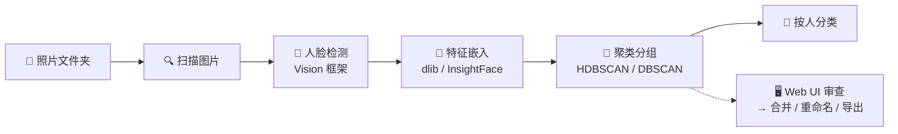
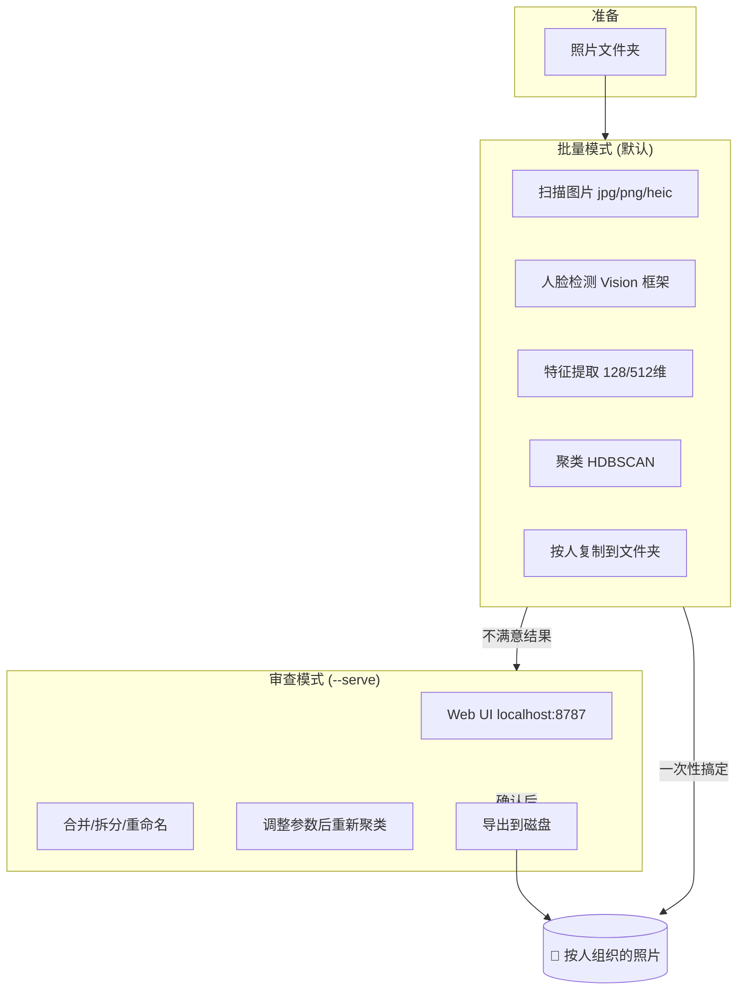

# Visage 👤

> macOS-native face clustering and photo sorter — scan photos, detect faces, group by person, organize into folders.



Visage 是一个命令行工具，自动扫描照片、识别人脸、按人分组。支持批量模式（直接输出）和交互模式（Web 界面手动核验）。

---

## 快速开始 Quick Start

### 安装

```bash
# 克隆仓库
git clone https://github.com/user/Visage.git
cd Visage

# 安装依赖 (推荐 uv)
brew install cmake                  # dlib 构建需要
uv sync --extra dev --extra insightface --extra web

# 或者用 pip
pip install -e ".[dev,insightface,web]"
```

### 一键整理照片

```bash
visage ~/照片/旅行
```

结果放在 `~/照片/旅行/visage_output/`，按人分文件夹：

```
visage_output/
├── person_00/   ← 第一个人 (所有他的照片)
├── person_01/   ← 第二个人
├── person_02/   ← 第三个人
└── ...
```

### 使用 Web UI 手动审查

```bash
visage ~/照片/旅行 --serve --backend insightface
```

浏览器自动打开 `http://localhost:8787`，可以进行：
- 浏览所有聚类分组
- 合并多个分组（同人不同组）
- 删除误检照片
- 重命名分组
- 调整聚类参数后重新聚类
- 导出整理结果到磁盘

## 工作流程 Workflow



## 功能亮点 Features

| 功能 | 说明 |
|------|------|
| **⚡ 硬件加速检测** | 使用 macOS Vision 框架，调用 Apple Neural Engine |
| **🧬 双嵌入后端** | dlib (默认) 或 InsightFace (更高精度) |
| **🔗 双聚类算法** | HDBSCAN (自适应密度) 或 DBSCAN (固定阈值) |
| **🖥️ Web 审查界面** | 合并/移动/删除/重命名/重新聚类，全部可视化 |
| **⏪ 可撤销操作** | 所有修改支持撤销 (历史栈) |
| **💾 嵌入缓存** | SQLite 缓存，重复运行无需重新计算 |
| **📷 HEIC 支持** | iPhone 照片原生支持 |
| **🔒 安全复制** | 默认复制不修改原文件，可选移动 |
| **🔄 检查点恢复** | 中断后可续跑 |
| **🔍 人脸搜索** | 根据嵌入向量在聚类中搜索相似人脸 |
| **⚡ FAISS 向量索引** | 高效向量检索，支持增量添加和软删除 |
| **📈 增量聚类** | ANN 投票 + 漂移检测，新图片无需全量重聚类 |
| **🏆 质量评分** | 自动选择每个聚类的最佳人脸 |
| **🤖 集成分类器** | KNN + SVM 加权投票，提高分类准确度 |
| **🖥️ 嵌入服务** | 独立嵌入进程，支持 GPU 加速和后端热切换 |

## 使用场景 Use Cases

### 按人整理家庭相册

```bash
visage ~/照片/2024年 --include-unclustered
```

### 高精度模式 (InsightFace + 大模型 + 多次采样)

```bash
visage ~/照片/相册 --serve --backend insightface --model large --num-jitters 10
```

### 只预览不修改

```bash
visage ~/照片/测试 --dry-run --json
```

### 配置自动估计聚类参数

```bash
visage ~/照片/相册 --auto-eps
```

### 自定义输出前缀

```bash
visage ~/照片/相册 --output-dir ~/整理后 --folder-prefix "朋友_"
```

## CLI 命令参考

### 基本用法

```bash
visage <输入目录> [选项]
```

### 常见选项速查

| 用途 | 选项 |
|------|------|
| 启动 Web 界面 | `--serve` |
| 指定端口 | `--port 8080` |
| 使用 InsightFace | `--backend insightface` |
| 使用大模型 | `--model large` |
| 调整聚类精度 | `--eps 0.6` |
| 包含未聚类照片 | `--include-unclustered` |
| 仅预览 | `--dry-run` |
| 移动而非复制 | `--move` |
| 输出 JSON | `--json` |
| 使用配置文件 | `--config my.toml` |

完整选项 → [CLI Reference](docs/reference.md)

## 配置文件 Config File

支持 TOML 格式配置文件 (自动发现输入目录下的 `visage.toml` 或通过 `--config` 指定)。

优先级：CLI 参数 > `--config` 文件 > 输入目录 `visage.toml` > 硬件推荐 > 代码默认值

```toml
[detection]
confidence = 0.6
min_face_size = 50

[embedding]
backend = "insightface"
model = "large"
num_jitters = 2

[clustering]
method = "hdbscan"
min_samples = 3
merge_threshold = 0.80
```

完整配置 → [Configuration Guide](docs/configuration.md)

## 调参技巧 Tuning Tips

| 问题 | 解决方案 |
|------|----------|
| **同人分到多组** | 提高 `--eps` (如 0.6) 或降低 `--merge-threshold` (如 0.70) |
| **不同人合并了** | 降低 `--eps` (如 0.3) |
| **漏检人脸** | 降低 `--min-confidence` (如 0.3) |
| **糊脸被归入** | 提高 `--min-quality` (如 0.3) |
| **多人合照处理** | Web UI 中手动分离 |
| **AI 生成图效果差** | `--head-feature-weight 0.0` (头部姿势变化大，不适合用头部特征) |

## 架构概览 Architecture

详细说明 → [Architecture Guide](docs/architecture.md)

```mermaid
flowchart TB
    subgraph Python Backend
        P1[scanner.py — 文件扫描]
        P2[detector.py — Vision 人脸检测]
        P3[embedder.py — 特征提取]
        P4[cluster/ — DBSCAN/HDBSCAN + 增量]
        P5[organizer.py — 文件整理]
    end

    subgraph Phase 2 Engine
        E1[embedding/ — 嵌入服务]
        E2[vector/ — FAISS 索引]
        E3[ensemble/ — 集成分类器]
        E4[quality/ — 质量评分]
    end

    subgraph Web Server
        S[app.py — FastAPI 服务]
        R[routes.py — API 路由]
        W[workspace.py — 内存状态]
        SE[search.py — 人脸搜索]
    end

    subgraph Frontend
        F[React SPA]
        C[components/ — UI 组件]
        ST[store/ — 状态管理]
    end

    P1 --> P2 --> P3 --> P4 --> P5
    P3 -.-> E1
    E1 --> E2
    P4 --> E3
    P4 --> E4
    E2 --> SE
    P4 -.->|web UI| W
    W --> R --> F
    F → C
    F → ST
```

## 开发 Development

- **运行测试**: `uv run pytest tests/` (513 个测试)
- **前端测试**: `cd frontend && npx vitest run` (91 个测试)
- **代码检查**: `uv run ruff check src/`
- **前端构建**: `cd frontend && npm run build`

详细 → [Development Guide](docs/development.md)

## 系统要求 Requirements

- macOS 13+ (Ventura 或更新)
- Python 3.10+
- cmake (用于构建 dlib): `brew install cmake`

## 许可证 License

MIT
