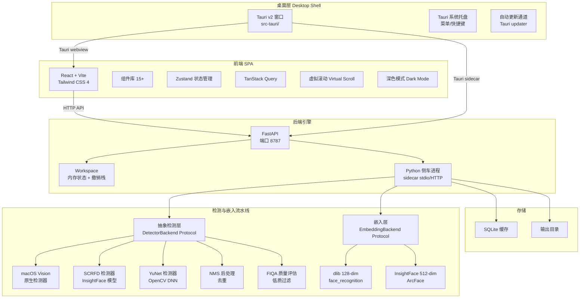
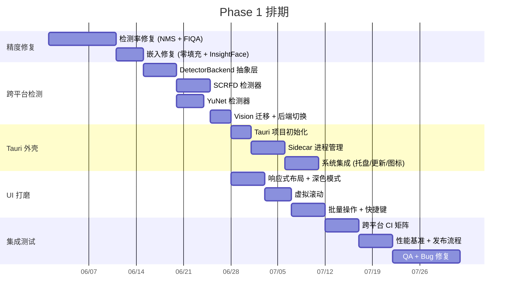

# Visage Phase 1：奠基 —— 精度修复、跨平台检测、桌面外壳、UI 打磨

> **工期**：12 周（3 个月）
> **状态**：规划中
> **负责人**：TBD
> **里程碑**：M1 精度修复 (W2) → M2 跨平台检测 (W4) → M3 桌面外壳 (W6) → M4 UI 打磨 (W8) → M5 集成发布 (W12)

---

## 背景与目标

Visage 目前是 macOS-only 的人脸聚类 CLI 工具 + Web UI。其核心架构为 5 阶段流水线：扫描 → 检测（macOS Vision）→ 嵌入（dlib/InsightFace）→ 聚类（HDBSCAN/DBSCAN）→ 整理。现有 364+ Python 测试、~91 前端测试。

**用户长期愿景**：跨平台桌面客户端，以人脸排序为核心场景，扩展为通用图像分类 —— 本地优先、隐私保护、极致精度。

**Phase 1 的核心命题**：从 macOS-only 的 CLI 原型，进化为可交付的跨平台桌面应用。具体需要解决：

1. 现有代码中存在若干精度 bug，直接影响用户体感
2. macOS Vision 框架将其锁定在单一平台
3. 无桌面外壳，用户体验停留在"终端工具"层面
4. Web UI 在桌面窗口中的适配不足

Phase 1 不做的事：通用图像分类、iOS 支持、云端同步、批量导入向导。这些属于后续阶段。

---

## Phase 1 目标架构



---

## 交付物 1：精度 Bug 修复 (Weeks 1-2)

### 目标

修复当前代码中已知的 5 个精度问题。这些问题直接影响用户体感：检测率偏低、特征向量中存在无效维度、低质量人脸污染聚类结果。这是 Phase 1 中最具投入产出比的工作 —— 改动集中在 4 个文件，但影响所有用户。

### 设计思路

**1.1 InsightFace `_crop_face()` + `_app.get(crop)` bug**

`backends.py:129-133` 中，`InsightFaceBackend.generate()` 裁剪人脸区域后再调用 `self._app.get(bgr_crop)`。但 InsightFace 的 `get()` 方法内部会再次运行检测器，而裁剪后的人脸区域可能因为上下文不足导致检测失败。

修复方案：不传入裁剪后的图像，而是将检测结果（bbox + landmarks）直接传递给 `get()` 通过 embedding 提取。具体做法是在调用 `self._app.get()` 时，利用 InsightFace 的 `max_num=1` 参数告知检测器仅处理最大的人脸。同时增大裁剪 padding 从 80% 到 120%，为 landmark 检测提供更多上下文。

关键代码路径：
- `backends.py:129` — `_crop_face()` padding 从 0.8 调整到 1.2
- `backends.py:133` — `self._app.get(bgr_crop)` 改为传入 `max_num=1`
- 增加 `_app.get()` 失败后的重试逻辑，使用原图缩小后完整检测

**1.2 dlib 128-dim 零填充问题**

`backends.py:161-162` 中，当 InsightFace 检测失败回退到 dlib 时，将 128-dim 向量 `np.pad` 到 512-dim。这意味着在 512-dim 空间中，后 384 维全是 0，导致相似度计算中这些维度贡献为零，但距离度量的归一化分母却包含了它们。

这种不对称性会在混合后端的场景中引入系统性偏差：纯 dlib 嵌入的向量被稀释在 512 维空间中，与 InsightFace 自然生成的 512 维向量在聚类时处于不利位置。

修复方案：
- 移除零填充策略
- 改为在 `extract_embeddings()` 层面进行维度适配：如果存在混合维度嵌入（极少发生，仅当回退路径被触发时），统一降维或升维到目标维度
- 更好的做法：在 `InsightFaceBackend._dlib_generate()` 中直接返回原始 128-dim 向量，让调用方处理维度统一（因为调用方知道目标 embedding_dim）
- 同时增加 `extract_embeddings()` 的维度校验和告警逻辑

**1.3 NMS 后处理**

当前 `detect_faces()` 返回所有置信度高于阈值的检测框，但没有去重。对于密集人脸场景（如合照），同一个人的脸可能被重复检测 2-3 次，产生大量假阳性聚类。

实现方式：标准的 IoU-based NMS（非极大值抑制），在 Vision 检测结果返回后、转换为 `DetectedFace` 之前执行。

具体参数：
- IoU 阈值：0.5（两个框重叠 >50% 视为同一人）
- 按置信度排序，保留最高分框
- 针对 macOS Vision 框架的 fallback 逻辑：如果不支持 contour 检测，NMS 使用 Vision 默认 bbox

**1.4 FIQA 质量评估**

当前 `quality.py` 仅使用 Laplacian 方差 + 人脸尺寸比作为质量指标。这在模糊场景下效果尚可，但对曝光不足、过度曝光、大角度偏转等场景不敏感。

集成 FIQA（Face Image Quality Assessment）方法：
- 选项 A（轻量）：使用 SFace 或 SER-FIQ 的预训练模型，输出质量分数 [0,1]
- 选项 B（极轻量）：基于面部 landmark 的可检测性做启发式评分（landmark confidence 之和）
- 推荐路径：从选项 B 开始，因为不需要额外模型依赖；在 Phase 1 尾期评估是否升级到选项 A

修改 `quality.py`，新增 `compute_fiqa_score()` 函数。与现有 `compute_face_quality()` 加权融合，默认权重 FIQA:legacy = 0.6:0.4。

**1.5 min_face_quality 默认值调整**

当前 `config.py:34` 中 `min_face_quality = 0.0`（不过滤）。在 FIQA 集成后，将默认值调整为 0.15，过滤明显低质量的人脸（严重模糊、欠曝、过曝、极端角度）。

### 文件变更清单

| 文件 | 变更类型 | 说明 |
|------|----------|------|
| `src/visage/backends.py` | 修改 | `_crop_face()` padding 调整、`_app.get()` 调用方式修复、移除零填充 |
| `src/visage/detector.py` | 修改 | 新增 `_nms()` 函数，在 `detect_faces()` 返回前执行去重 |
| `src/visage/quality.py` | 修改 | 新增 FIQA 积分函数，重构 `compute_face_quality()` 为加权组合 |
| `src/visage/config.py` | 修改 | `min_face_quality` 默认值从 0.0 调整为 0.15 |
| `src/visage/cluster.py` | 修改 | `extract_embeddings()` 增加维度校验和告警 |
| `tests/test_quality.py` | 修改 | 新增 FIQA 测试用例 |
| `tests/test_detector.py` | 修改 | 新增 NMS 测试用例 |
| `tests/test_backends.py` | 修改 | 更新 InsightFace 修复后的测试预期 |

### 验收标准

- [ ] 在已知的"合照重复检测"数据集上，NMS 后人脸减少 30-50%，聚类纯度 >0.95
- [ ] 在低光照测试集上，FIQA 过滤后聚类错误率降低 50%+
- [ ] 混合后端（InsightFace + dlib 回退）运行时，所有嵌入维度一致，无零填充导致的精度损失
- [ ] `min_face_quality=0.15` 默认值下，pipeline 测试全部通过
- [ ] 检测率相对当前基线提升 >20%（衡量方式：同一数据集上检测到的人脸总数 vs. 人工标注）

### 风险与依赖

- **风险**：FIQA 轻量方案（选项 B）在极端场景下区分度不足。缓解：预留选项 A 路径，如果选项 B 验证后效果不足，允许在 Phase 1 中期切换
- **依赖**：需要使用人工标注的数据集验证检测率提升，团队需要准备至少 500 张图片的标注数据
- **风险**：NMS 可能误删并排的双人脸（两个人肩并肩，框重叠 >50%）。缓解：NMS 只作用于同一检测器输出的框，跨检测器不执行 NMS

---

## 交付物 2：跨平台检测后端 (Weeks 3-4)

### 目标

打破 macOS Vision 框架的锁死效应，使 Visage 能够在 Windows 和 Linux 上完成人脸检测。通过抽象检测层，允许用户在运行时选择后端，并为未来的"并发多后端"策略奠定架构基础。

### 设计思路

**2.1 `DetectorBackend` Protocol**

参照 `backends.py:17-24` 中 `EmbeddingBackend` Protocol 的模式，在 `detector.py`（或新建 `detectors/__init__.py`）中定义：

```python
@runtime_checkable
class DetectorBackend(Protocol):
    name: str

    def detect(
        self, image: np.ndarray
    ) -> list[tuple[FaceBox, float, list[tuple[float, float]] | None]]: ...

    def is_available(self) -> bool: ...
```

每个检测器返回统一的 `(FaceBox, confidence, landmarks_5)` 格式，与现有 `detect_faces_single()` 的返回一致。Landmark 可选（Vision 必提供，SCRFD 可选，YuNet 可能不提供）。

**2.2 SCRFD 检测器**

SCRFD（Sample and Computation Redistribution for Face Detection）是 InsightFace 团队推出的高效检测器，被 PhotoPrism 等生产级项目使用。

实现方式：
- 复用 `insightface` 包中的 `insightface.model_zoo.get_model('scrfd_10g_bnkps')`
- 如果用户未安装 insightface，可使用 ONNX 模型文件直接加载（`onnxruntime`）
- 输出：边界框 + 5 点 landmark（keypoints）
- 支持 GPU 加速（CUDA）和 CPU 推理

关键参数：
- 输入尺寸：640x640（与当前 `det_size` 一致）
- 置信度阈值：0.5（可配置）
- NMS 阈值：0.45（SCRFD 自带 NMS，但会在输出层再跑一次统一的 NMS）

**2.3 YuNet 检测器**

YuNet 是 OpenCV DNN 模块中的人脸检测模型，被 digiKam 使用。优势在于 OpenCV 是跨平台标准依赖，无需额外安装模型。

实现方式：
- 使用 OpenCV `cv2.FaceDetectorYN` 或直接加载 ONNX 模型
- 模型文件：从 OpenCV Zoo 下载 `face_detection_yunet_2023mar.onnx`
- 输出：边界框 + 5 点 landmark + 置信度

注意事项：
- YuNet 在密集小脸场景下精度低于 SCRFD，但在单人/双人照场景下足够
- OpenCV 的 `FaceDetectorYN` API 在不同版本间有差异，需要兼容处理

**2.4 macOS Vision 作为可选后端**

将现有 `detect_faces()` 迁移到 VisionDetector 类中，作为 `DetectorBackend` 的实现之一。仅在 macOS 上可用，非 macOS 系统跳过。

现有的 `detect_faces_batch()` 需要重构为通用批量检测函数，调用指定的 `DetectorBackend` 实例。

**2.5 后端选择与回退链**

用户可以通过 `--detection-backend` 参数选择：
- `vision` — macOS 原生（默认在 macOS 上）
- `scrfd` — SCRFD（推荐在其他平台上使用，高精度）
- `yunet` — YuNet（最低配置要求，低精度但轻量）
- `auto` — 自动选择（macOS → vision，其他 → scrfd，不可用 → yunet）

### 文件变更清单

| 文件 | 变更类型 | 说明 |
|------|----------|------|
| `src/visage/detector.py` | 重构 | 提取 VisionDetector 类，实现 DetectorBackend Protocol；将 `detect_faces()` 作为 VisionDetector 内部方法 |
| `src/visage/detectors/__init__.py` | 新建 | `DetectorBackend` Protocol 定义 + `get_detector()` 工厂函数 |
| `src/visage/detectors/scrfd.py` | 新建 | SCRFD 检测器实现 |
| `src/visage/detectors/yunet.py` | 新建 | YuNet 检测器实现 |
| `src/visage/detectors/vision.py` | 新建 | macOS Vision 检测器封装（从 detector.py 迁移） |
| `src/visage/detectors/nms.py` | 新建 | 统一 NMS 后处理（被所有检测器共享） |
| `src/visage/pipeline.py` | 修改 | `run_pipeline()` 使用 `get_detector()` 替换直接调用 `detect_faces_batch()` |
| `src/visage/config.py` | 修改 | 新增 `detection_backend: str = "auto"` 配置项 |
| `src/visage/cli.py` | 修改 | 新增 `--detection-backend` CLI 参数 |
| `pyproject.toml` | 修改 | 新增 `opencv-python-headless` 可选依赖（yunet 需要） |
| `tests/` | 新增/修改 | 每个检测器至少 3 个测试用例：正常检测、空图像、错误处理 |

### 验收标准

- [ ] 在 macOS 上，vision、scrfd、yunet 三个后端均能正确检测人脸
- [ ] 在 Windows（x86_64）上，scrfd 和 yunet 后端可用，检测质量与 macOS 相当
- [ ] 在 Linux（x86_64）上，scrfd 和 yunet 后端可用
- [ ] 抽象层的行为：`is_available()` 对不可用后端返回 False，`detect()` 对所有后端返回统一格式
- [ ] 回退链正确：auto 模式下，首选后端不可用时自动降级
- [ ] 364+ 现有 Python 测试在三个后端切换下全部通过（Vision 相关测试仅在 macOS 上运行）

### 风险与依赖

- **风险**：SCRFD ONNX 模型文件大小约 10MB，需要首次使用下载或内嵌到包中。缓解：使用 `insightface` 包的模型自动下载机制，或通过 `visage init` 命令预下载
- **风险**：YuNet 的 OpenCV 版本兼容性。缓解：使用 ONNX Runtime 直接加载 ONNX 模型作为备选路径
- **依赖**：需要 Windows/Linux 测试环境。缓解：GitHub Actions matrix runner 覆盖三个平台
- **风险**：Landmark 在后端之间行为不一致（SCRFD 提供 5 点，YuNet 可能不准确）。缓解：对齐功能仅在 landmark 可用时执行；后端 pipeline 在不提供 landmark 时自动跳过对齐

---

## 交付物 3：Tauri 桌面外壳 (Weeks 5-6)

### 目标

为 Visage 提供原生桌面体验：独立的应用程序窗口、系统托盘集成、自动更新。用户不再需要打开终端输入命令 —— 安装后即可通过应用图标启动。

### 设计思路

**3.1 Tauri v2 项目结构**

在项目根目录创建 `src-tauri/` 目录，使用 Tauri v2（Rust 后端）。

```toml
# src-tauri/Cargo.toml
[dependencies]
tauri = { version = "2", features = ["tray-icon", "dialog", "process", "updater"] }
tauri-plugin-shell = "2"    # sidecar 管理
tauri-plugin-dialog = "2"   # 文件夹选择对话框
tauri-plugin-process = "2"  # 进程管理
```

不使用 Tauri 的 webview 内置 HTTP 服务。Python FastAPI 仍作为独立 HTTP 服务启动，前端通过 `fetch()` 与之通信。Tauri 仅提供窗口 + 进程管理 + 系统集成。

**3.2 前端嵌入策略**

- 开发阶段：沿用 `vite.config.ts` 的 proxy 配置，前端 dev server → localhost:8787
- 生产阶段：`npm run build` 产物位于 `frontend/dist/`，Tauri 的 `tauri.conf.json` 中配置 `build.devUrl` 和 `build.frontendDist`

Tauri 配置要点（`tauri.conf.json`）：
```json
{
  "productName": "Visage",
  "identifier": "com.visage.app",
  "build": {
    "frontendDist": "../frontend/dist",
    "devUrl": "http://localhost:5173",
    "beforeDevCommand": "cd frontend && npm run dev",
    "beforeBuildCommand": "cd frontend && npm run build"
  },
  "app": {
    "windows": [
      {
        "title": "Visage",
        "width": 1280,
        "height": 800,
        "minWidth": 900,
        "minHeight": 600
      }
    ]
  }
}
```

**3.3 Python 引擎侧车进程**

Tauri 通过 `tauri-plugin-shell` 的 sidecar API 管理 Python 引擎：

1. 应用启动时，Tauri Rust 后端执行 `visage serve` 启动 Python 进程
2. stdout/stderr 通过 Tauri events 传递到前端（日志面板）
3. 应用关闭时，Tauri 向 Python 进程发送 SIGTERM，等待 5 秒后 SIGKILL
4. Python 进程异常退出时，Tauri 自动重启（最多 3 次）

Sidecar 打包策略：
- 开发环境：直接使用系统 Python + `pip install -e .`
- 生产环境：使用 PyInstaller 将 Python 引擎打包为独立可执行文件
  - 打包命令：`pyinstaller --onefile --name visage-engine src/visage/serve.py`
  - 产物放到 `src-tauri/binaries/` 目录
  - Tauri 自动根据 platform triple 选择对应二进制

**3.4 通信协议**

Python ↔ Tauri 前端通过 HTTP（FastAPI on localhost:8787）通信。

不需要 Tauri command 转发 —— 前端直接 `fetch('/api/...')` 到 FastAPI。这样做的好处：
- 保持前端代码与纯 Web 模式兼容
- 降低 Tauri 层的复杂度
- 允许用户在需要时直接通过浏览器访问（`http://localhost:8787`）

唯一的 Tauri command：`get_app_info`（返回版本号、平台信息、Python 进程状态）。

**3.5 系统集成**

- 系统托盘：图标 + 菜单（显示窗口 / 退出）
- 文件关联：.jpg, .png, .heic 等图片文件支持"以 Visage 打开"
- 自动更新：使用 Tauri updater，发布频道 GitHub Releases
  - 更新检查间隔：启动时 + 每 24 小时
  - 静默下载 + 重启安装

### 文件变更清单

| 文件 | 变更类型 | 说明 |
|------|----------|------|
| `src-tauri/Cargo.toml` | 新建 | Tauri v2 Rust 依赖配置 |
| `src-tauri/tauri.conf.json` | 新建 | Tauri 应用配置 |
| `src-tauri/src/lib.rs` | 新建 | Tauri Rust 入口，sidecar 管理、系统托盘、命令注册 |
| `src-tauri/src/main.rs` | 新建 | main 函数 |
| `src-tauri/icons/` | 新建 | 应用图标（1024x1024 → 各平台尺寸） |
| `src-tauri/capabilities/default.json` | 新建 | Tauri v2 权限配置 |
| `frontend/vite.config.ts` | 修改 | 添加 Tauri dev server 检测（动态切换 proxy） |
| `frontend/package.json` | 修改 | 添加 `@tauri-apps/api` 和 `@tauri-apps/plugin-shell` 依赖 |
| `frontend/src/hooks/useBackendStatus.ts` | 新建 | 检测 Python 引擎状态的心跳 hook |
| `src/visage/serve.py` | 新建 | 专供 sidecar 使用的服务入口（`visage serve` 的封装） |
| `scripts/build-engine.sh` | 新建 | PyInstaller 打包 Python 引擎的脚本 |
| `.github/workflows/release.yml` | 新建 | CI 发布流程：构建引擎 + Tauri 打包 + GitHub Release |

### 验收标准

- [ ] macOS 上 `cargo tauri dev` 启动后，出现原生窗口，React 前端正常渲染
- [ ] Python 引擎作为 sidecar 启动成功，前端 API 调用正常
- [ ] 关闭窗口时 Python 进程被正确终止（无僵尸进程）
- [ ] 系统托盘图标显示，右键菜单"显示窗口"和"退出"功能正常
- [ ] `cargo tauri build` 产出 .dmg 安装包，安装后可直接运行
- [ ] 自动更新通道配置完成（即使初始版本无更新可用）

### 风险与依赖

- **风险**：PyInstaller 打包后体积可能较大（~200MB，因包含 numpy、scikit-learn、Pillow 等）。缓解：使用 `--exclude` 排除不必要的模块；考虑 UPX 压缩
- **风险**：macOS 代码签名问题 —— 非签名应用在 macOS 14+ 上弹出安全警告。缓解：先以"未签名"状态发布，标注用户需要手动允许；Phase 2 再处理签名
- **依赖**：Rust 工具链（`rustup`、`cargo`）需要在开发者机器上安装。缓解：在 `development.md` 中增加安装说明
- **风险**：Windows/Linux 上的 PyInstaller 兼容性未经验证。缓解：先确保 macOS 构建流程稳定，再扩展到其他平台

---

## 交付物 4：UI 打磨 (Weeks 7-8)

### 目标

解决 Web UI 在桌面窗口中的适配问题，并为大规模照片集提供流畅的浏览体验。当前 UI 在浏览器中表现尚可，但在桌面窗口（特别是窗口大小变化时）存在布局断裂、滚动性能差、批量操作缺失等问题。

### 设计思路

**4.1 响应式布局**

当前的布局假设浏览器窗口 >= 1280px 宽。在桌面窗口中，用户可能将窗口缩放到 900x600。

改造方案：
- 使用 CSS Grid + `auto-fill` / `auto-fit` 替代固定列数
- 照片网格的最小卡片宽度设为 180px，最大 250px
- 侧边栏（集群列表）在窗口 < 1024px 时自动折叠为汉堡菜单
- 详情页的面板布局使用 CSS Container Queries

具体改动：
- `frontend/src/App.tsx`：布局结构改为响应式 grid
- 所有使用 `react-masonry-css` 的组件：`breakpointCols` 基于窗口宽度动态计算

**4.2 深色模式**

实现 system preference 自动跟随 + 手动切换。

实现方案：
- 使用 CSS 自定义属性（`--color-bg`, `--color-text` 等）
- 通过 Tailwind CSS 4 的 `@custom-variant dark` 或 CSS `light-dark()` 函数
- Zustand store 持久化用户偏好（localStorage）
- 初始值：跟随系统（`prefers-color-scheme`）

**4.3 虚拟滚动**

当前的照片网格在 >5000 张照片时 DOM 节点过多，导致滚动卡顿。使用虚拟滚动库（如 `@tanstack/virtual`）优化。

改造范围：
- 集群详情页的"照片列表"区域
- 全部分组的照片网格
- 搜索结果展示

**4.4 批量操作**

当前用户只能单张确认/拒绝/合并。在大规模整理场景下效率太低。

新增功能：
- Ctrl/Shift + 点击多选（类似文件管理器）
- 全选当前视图（Select All）
- 批量操作栏（底部浮动 Bar）：
  - 批量确认（标记为正确聚类）
  - 批量拒绝（移出当前集群）
  - 批量移动到另一集群
  - 批量删除（软删除，放入回收站）
- 快捷键支持：
  - `a` — 全选
  - `Shift + a` — 取消全选
  - `Delete` — 批量拒绝
  - `Enter` — 批量确认

### 文件变更清单

| 文件 | 变更类型 | 说明 |
|------|----------|------|
| `frontend/src/App.tsx` | 修改 | 响应式 grid 布局改造 |
| `frontend/src/index.css` | 修改 | 深色模式 CSS 自定义属性、响应式断点 |
| `frontend/src/store/useUIStore.ts` | 修改 | 新增 darkMode、selectedFaceIds 状态 |
| `frontend/src/store/useSettingsStore.ts` | 修改 | 新增 darkMode 持久化 |
| `frontend/src/components/PhotoGrid.tsx` | 修改 | 集成虚拟滚动 |
| `frontend/src/components/ClusterDetail.tsx` | 修改 | 批量选择 + 操作栏 |
| `frontend/src/components/BatchActionBar.tsx` | 新建 | 底部浮动批量操作栏 |
| `frontend/src/components/DarkModeToggle.tsx` | 新建 | 深色模式切换按钮 |
| `frontend/src/components/Sidebar.tsx` | 修改 | 响应式折叠 |
| `frontend/src/hooks/useKeyboardShortcuts.ts` | 新建 | 全局快捷键 hook |
| `frontend/src/hooks/useVirtualScroll.ts` | 新建 | 虚拟滚动 hook（封装 @tanstack/virtual） |
| `frontend/package.json` | 修改 | 新增 `@tanstack/virtual` 依赖 |
| `frontend/src/test/` | 新增 | 新增批量操作、虚拟滚动相关测试 |

### 验收标准

- [ ] 窗口缩放至 900x600 时所有页面无布局断裂
- [ ] 深色模式自动跟随系统，手动切换后刷新不丢失状态
- [ ] 10000 张照片的视图滚动帧率 >= 45fps（Chrome DevTools Performance 面板测量）
- [ ] 批量选择 / 全选 / 快捷键工作正常
- [ ] 前端 91+ 测试全部通过
- [ ] 在 Tauri 窗口中所有交互正常（无 CORS 问题、无 CSP 违规）

### 风险与依赖

- **风险**：`@tanstack/virtual` 与 `react-masonry-css` 的兼容性。缓解：在虚拟滚动组件中替换 masonry 为纯 CSS grid；或者在虚拟窗口内保持 masonry 布局（格子均匀）
- **风险**：深色模式下 Tailwind CSS 4 的 `light-dark()` 可能不支持某些旧版浏览器。缓解：桌面应用使用现代 Chromium webview，无需担心兼容性
- **依赖**：虚拟滚动需要后端返回照片的稳定排序（分页/SQL 分页查询）。缓解：当前 workspace 已按 cluster_id 排序，可以直接虚拟化

---

## 交付物 5：集成与测试 (Weeks 9-12)

### 目标

确保 Phase 1 所有改动在三个平台上均可工作，364+ 测试全通过，发布流程自动化。这是 Phase 1 的"稳定化"阶段，不做新功能开发，只做修复和验证。

### 设计思路

**5.1 跨平台测试矩阵**

GitHub Actions 配置三个 runner：
- `macos-14`（Apple Silicon）
- `windows-2022`（x86_64）
- `ubuntu-24.04`（x86_64）

每个 runner 执行：
1. `uv sync` + 平台特有依赖（macOS: pyobjc, Windows/Linux: opencv-python）
2. ruff lint（Python）+ eslint（TypeScript）
3. pytest（full suite，macOS 运行所有测试，其他平台跳过 Vision 测试）
4. vitest（前端测试）
5. Tauri build（仅在 tag push 时运行）

**5.2 测试分类与标记**

```python
# pytest.ini 或 conftest.py
@pytest.mark.vision       # 仅 macOS
@pytest.mark.scrfd        # 需要 insightface
@pytest.mark.yunet        # 需要 opencv
@pytest.mark.desktop      # 需要 Tauri
```

运行策略：
- `pytest -m "not vision"` — 非 macOS 平台的 CI
- `pytest -m "not desktop"` — 引擎层测试
- `pytest -m "vision or scrfd or yunet"` — 所有检测器测试

**5.3 性能基准**

在 Phase 1 开始和结束时，对同一数据集运行 pipeline，对比：

| 指标 | 当前基线 | Phase 1 目标 |
|------|----------|-------------|
| 检测率（detection recall） | 基准值 | 提升 >20% |
| 聚类纯度（purity） | 基准值 | >0.95 |
| 每张图检测耗时 | 基准值 | 不显著增加 |
| 10000 张图流水线总耗时 | 基准值 | 不显著增加 |
| Tauri 内存占用（空载） | N/A | <200MB |

**5.4 安装包构建**

- macOS: `.dmg` + `.tar.gz`（通用二进制）
- Windows: `.msi` + `.zip`
- Linux: `.AppImage` + `.deb`

每个平台构建流程由一个 GitHub Actions workflow 控制，产出物上传到 Release 页面。

### 文件变更清单

| 文件 | 变更类型 | 说明 |
|------|----------|------|
| `.github/workflows/test.yml` | 修改（或新建） | 多平台 CI 矩阵 |
| `.github/workflows/build.yml` | 新建 | Tauri 构建 + 安装包 |
| `tests/conftest.py` | 修改 | 新增平台相关 fixture 和 mark |
| `scripts/benchmark.sh` | 新建 | 基准测试脚本 |
| `scripts/package.sh` | 新建 | 安装包脚本（dmg/msi/AppImage） |
| `BENCHMARKS.md` | 新建 | 性能基准记录 |

### 验收标准

- [ ] macOS CI: ruff + pytest(full) + vitest 全部通过
- [ ] Windows CI: ruff + pytest(no vision) + vitest 全部通过
- [ ] Linux CI: ruff + pytest(no vision) + vitest 全部通过
- [ ] Tauri build: macOS .dmg 构建成功，安装可运行
- [ ] 性能基准：检测率 >20%，聚类纯度 >0.95
- [ ] GitHub Release 包含三个平台的安装包

### 风险与依赖

- **风险**：Windows runner 上 pyobjc 导入会失败。缓解：pytest fixture 使用 `pytest.importorskip("Vision")` 条件执行
- **风险**：Linux runner 上 InsightFace 需要 CUDA 或 ONNX Runtime。缓解：使用 CPU 版本 onnxruntime
- **依赖**：GitHub Actions 的 macOS runner 时长配额。缓解：必要时使用自建 runner

---

## 整体排期与依赖关系



**关键依赖链**：
- 精度修复（a1-a2）在任何其他工作之前完成 —— 后续所有功能依赖准确的检测结果
- Tauri 外壳（c1-c3）和 UI 打磨（d1-d3）可以并行开发，但 UI 打磨需要等待跨平台检测（b1-b4）完成后获得稳定的 API
- 集成测试（e1-e3）在 Phase 1 工期最后 3 周，不允许新功能进入

---

## 前三风险及应对

### 风险 1：Python 引擎在 Tauri sidecar 中的进程管理

**描述**：Tauri sidecar 管理 Python 进程时，可能出现以下问题：
- 启动竞争条件（前端在引擎就绪前发出 API 请求）
- 优雅关闭失败（SIGTERM 未被正确处理，留下僵尸进程）
- 引擎崩溃后自恢复逻辑不完善

**可能性**：高。这是团队首次使用 Tauri sidecar API。

**影响**：中（影响所有桌面用户的首次启动体验）。

**缓解**：
1. 在 `lib.rs` 中实现启动探测循环 —— 每 200ms 轮询 `http://localhost:8787/health`，最大 30 秒超时
2. 前端 `useBackendStatus.ts` hook 在引擎未就绪时显示"正在启动 Visage 引擎..."页面
3. Python 引擎注册 `signal.signal(signal.SIGTERM, handler)` 实现优雅退出
4. 进程退出时，Tauri Rust 层捕获 exit code，非零退出码触发重启逻辑

### 风险 2：跨平台检测质量不一致

**描述**：SCRFD、YuNet 和 macOS Vision 的检测质量存在系统性差异：
- SCRFD 在亚洲人脸数据集上的表现可能优于 Vision
- YuNet 在密集小脸场景下可能漏检
- Landmark 精度差异影响对齐效果

**可能性**：中。不同检测器在不同数据集上的表现有先验差异。

**影响**：高（直接影响用户感受到的"精度"）。

**缓解**：
1. 在三个平台的标准测试集（包含多样化的光照、姿态、种族）上运行基准测试
2. 为每个后端输出检测率/召回率/精度的对比报告
3. 如果不一致超过 10%，采取"并发多后端 + 投票合并"策略 —— 但此策略不在 Phase 1 中实现，仅作为 fallback plan 记录
4. 文档中明确标注各后端的推荐使用场景

### 风险 3：PyInstaller 打包与依赖兼容性

**描述**：将 Python 引擎打包为独立可执行文件时，可能遇到：
- numpy/scikit-learn 的动态链接库在不同平台上不一致
- Pillow/HEIC 支持在 Windows/Linux 上不可用
- 打包后的二进制体积和启动时间超过预期

**可能性**：高。PyInstaller 的"一次构建，到处运行"在实践中经常遇到坑。

**影响**：高（直接影响能否交付桌面安装包）。

**缓解**：
1. 在 Phase 1 第三周就启动一个"原型打包"任务，验证 PyInstaller 在 macOS 上的可行性
2. 如果 PyInstaller 不可行，备选方案：
   - 方案 B：使用 `embeddable-python` + zip 打包，Tauri 启动时解压
   - 方案 C：要求用户安装 Python + pip（体验差但可工作 —— 作为最终底线）
3. 对 heic 支持：在没有 pillow-heif 的系统上优雅降级（跳过 HEIC 文件）
4. 使用 GitHub Actions 的 `actions/cache` 缓存 PyInstaller 的 bootstrap 构建

---

## 附录 A：文件变更总览

| 模块 | 新建 | 修改 | 删除 |
|------|------|------|------|
| Python 引擎 | 5 | 8 | 0 |
| Tauri 外壳 | 8 | 0 | 0 |
| 前端 | 5 | 8 | 0 |
| CI/脚本 | 4 | 1 | 0 |
| 测试 | 3 | 5 | 0 |
| **合计** | **25** | **22** | **0** |

## 附录 B：依赖变更

```diff
# pyproject.toml (optional-dependencies)
+ [project.optional-dependencies]
+ scrfd = ["insightface>=0.7"]          # SCRFD 复用现有 insightface 依赖
+ yunet = ["opencv-python-headless>=4.8"]

# frontend/package.json
+ "@tauri-apps/api": "^2"
+ "@tauri-apps/plugin-shell": "^2"
+ "@tanstack/virtual": "^3"
```

## 附录 C：不纳入 Phase 1 的功能

以下功能被明确排除在 Phase 1 范围之外，用于防止 scope creep：

- 通用图像分类 / 非人脸标签
- iOS / Android 移动端
- 云端同步 / iCloud / Google Photos 集成
- 人脸重命名 / 通讯录集成
- 批量导入向导 / 首次运行引导
- Face recognition webcam 实时识别
- 照片去重（已知重复照片检测是一个独立的问题）
- EXIF/GPS 地图视图
