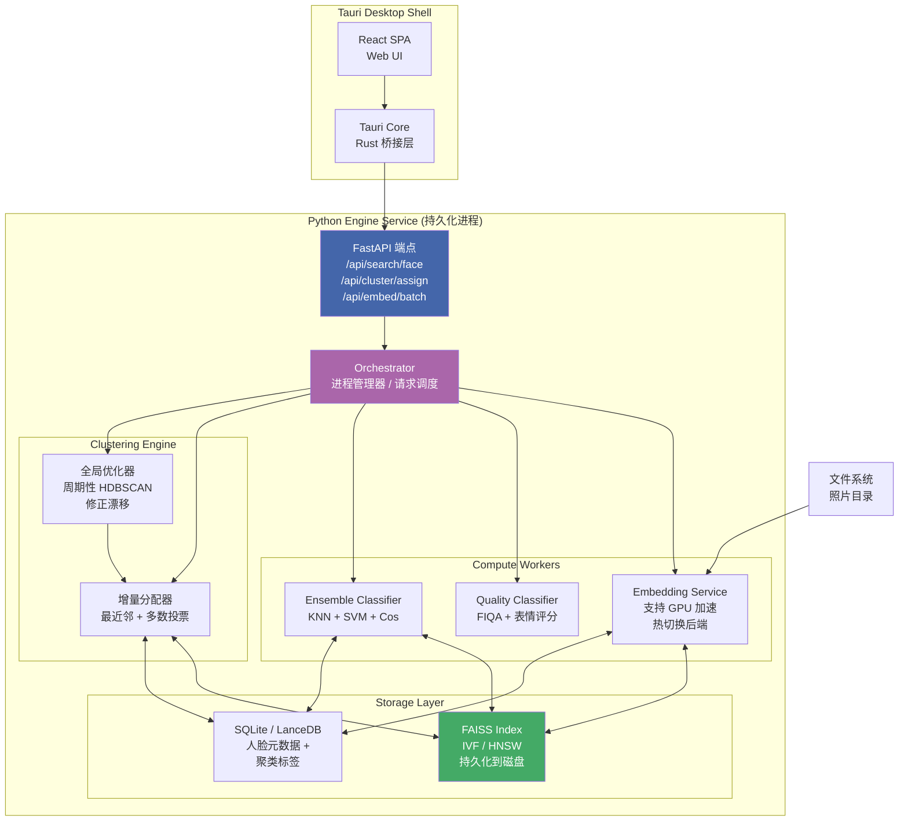

# Visage Phase 2：从批处理脚本到实时 AI 照片引擎

> **时间窗口**：Phase 1 完成后 3-9 个月
> **核心理念**：将 Visage 从"每次运行重新计算"的批处理管道，演变为"持续运行的持久化引擎"，支持增量处理、向量搜索、质量评估和集成分类。

---

## 目标架构总览

Phase 2 引入三个架构层面的根本变化：

1. **嵌入服务进程化**：嵌入推理从 CLI 的一次性子过程升级为常驻后台服务，持续处理新照片
2. **向量数据库持久化**：从内存 numpy 数组迁移到 FAISS 磁盘索引，支持 10 万级人脸实时检索
3. **增量聚类**：从全量 HDBSCAN 重聚类变为"最近邻分配 + 周期性全局优化"的混合策略



---

## 交付项 1：嵌入服务进程 (Embedding Service Process)

### 目标

将嵌入生成从 CLI 一次性管线中独立出来，成为一个常驻后台服务进程，通过 HTTP 或 stdio-JSON 协议与 Tauri 侧车通信。支持 GPU 加速、请求队列、批量优化和后端热切换。

### 设计思路

**为什么需要独立进程？**

当前架构中，每次 `visage` 调用都重新初始化检测器/嵌入器、分配 GPU 显存、运行管道后释放。对于数千张照片的库，这意味着每次启动/关闭开销高达 2-5 秒。Phase 1 完成后嵌入器已经是跨平台的（SCRFD/YuNet），更需要一个持续保持热加载的进程。

**架构决策**

1. **协议选择：HTTP (localhost) + JSON**
   - Tauri 侧车通过子进程启动 Python 引擎
   - 引擎启动后监听 `127.0.0.1:<dynamic-port>`，返回端口号给 Tauri
   - Tauri 通过 HTTP 发送嵌入请求，引擎返回结果
   - 优点：调试方便（curl 可直接测试），Tauri HTTP 插件成熟
   - 备选方案：stdio-JSON（减少端口占用，但调试困难），留作后续优化

2. **GPU 加速策略**
   - macOS: `mps` 设备（PyTorch MPS backend），Metal 加速
   - Linux/Windows: `cuda` 设备，按显存自动选择 batch size
   - 启动时自动检测可用设备，fallback 到 CPU
   - 嵌入请求支持 `priority` 字段：`high`（用户主动请求）和 `low`（后台批量处理）

3. **请求队列**
   - 使用 `asyncio.Queue` 管理请求
   - 高优先级请求插队
   - 批量合并：队列中等待 50ms 或积累 16 个请求后合并为 batch 推理
   - 最大等待时间 200ms，防止饥饿

4. **热切换后端**
   - 支持当前运行中切换嵌入后端，无需重启进程
   - 设计 `EmbeddingBackend` 抽象基类，ArcFace / SFace / resnet 分别实现
   - 切换时优雅等待当前 batch 完成，加载新模型到设备

**进程生命周期**

```
Tauri 启动 → 启动 Python 引擎进程 → 引擎初始化模型 → 返回端口
→ Tauri 缓存端口 → 引擎进入事件循环 → 处理请求 → Tauri 退出 → 发送 SIGTERM → 引擎保存状态 → 退出
```

### 文件变更清单

| 文件 | 变更类型 | 说明 |
|------|----------|------|
| `src/visage/embedding/service.py` | 新增 | 嵌入服务进程入口，HTTP 服务 + 事件循环 |
| `src/visage/embedding/backend.py` | 新增 | `EmbeddingBackend` 抽象基类，ArcFace/SFace/resnet 实现 |
| `src/visage/embedding/batcher.py` | 新增 | 请求队列 + 批量合并调度器 |
| `src/visage/embedding/gpu.py` | 新增 | GPU 设备检测、显存管理、自动 fallback |
| `pyproject.toml` | 修改 | 新增 `visage-engine` CLI entry point |
| `src-tauri/src/engine.rs` | 新增 | Tauri 侧：启动/停止引擎进程，HTTP 客户端封装 |

### 验收标准

- 启动后 3 秒内模型就绪，返回端口
- 单张新人脸嵌入生成 <500ms（GPU）/ <1500ms（CPU）
- 批量 16 张嵌入生成 <2000ms（GPU）
- 热切换后端耗时 <1000ms，不丢请求
- 进程退出时保存状态 <500ms

### 风险与依赖

- **风险**：MPS backend 在 Apple Silicon 上存在精度不稳定（某些操作回退 CPU）。**缓解**：增加 `torch.backends.mps.is_built()` 检测 + CI 精度回归测试
- **风险**：Tauri 侧车进程管理复杂，子进程僵尸化。**缓解**：使用 `process-group` 模式，Tauri 退出时强制 kill 整个进程组

---

## 交付项 2：FAISS 向量数据库 (FAISS Vector Database)

### 目标

用 FAISS 磁盘索引替代内存 numpy 数组存储所有人脸嵌入向量，支持增量添加、近似最近邻搜索（ANN）、索引持久化，并在应用重启后自动加载。

### 设计思路

**当前问题**

Face embeddings 目前以 numpy 数组形式存在于 `Workspace` 内存中。当照片数超过 1 万张，内存占用可达 200-500MB，且每次重启需要全量重新嵌入。搜索是暴力 O(n)，10 万张时单次搜索需 50-100ms，无法支撑实时搜索。

**索引设计**

1. **索引类型选择：IVF4096,Flat**
   - IVF（Inverted File）：训练阶段将向量空间划分为 4096 个 Voronoi cell，搜索时只搜索最近的 2-3 个 cell
   - Flat 精度无损，适合 10 万级规模
   - HNSW 作为备选（更高召回但内存占用多 3-5 倍），将在 50 万+ 规模时启用
   - 向量维度：128（dlib）或 512（ArcFace），根据当前后端自动选择

2. **索引持久化格式**
   ```
   <workspace_dir>/
     faiss/
       index.faiss       # FAISS 主索引文件
       index.meta        # JSON: 版本号、维度、后端类型、向量总数
     faces/
       <face_id>.jpg     # 裁剪后的人脸缩略图（可选缓存）
   ```

3. **增量更新**
   - 新增向量：`index.add_with_ids(vectors, ids)` — FAISS 原生支持，O(1)
   - 删除向量：不原地删除（FAISS 没有 O(1) 删除），标记为 deleted_ids，周期性重建索引
   - 重建阈值：当 deleted_ids 超过总数 10% 或累积 5000 个删除时触发
   - 重建在后台线程执行，不影响当前搜索

4. **元数据存储**
   - 使用 SQLite（轻量、零配置）存储人脸和簇的元数据
   - 表结构：
     ```sql
     CREATE TABLE faces (
       face_id TEXT PRIMARY KEY,
       image_path TEXT NOT NULL,
       cluster_id TEXT,
       embedding_backend TEXT NOT NULL,
       quality_score REAL DEFAULT 0.0,
       created_at TIMESTAMP DEFAULT CURRENT_TIMESTAMP
     );
     CREATE INDEX idx_cluster ON faces(cluster_id);
     CREATE INDEX idx_image ON faces(image_path);
     ```

5. **备选：LanceDB**
   - 若元数据查询复杂度增长（如需要按日期、相机、标签组合过滤），考虑迁移到 LanceDB
   - LanceDB 原生支持向量 + 列式元数据混合查询
   - 但增加一个系统依赖，需评估。Phase 2 优先 SQLite，LanceDB 作为 Phase 3 预研

### 文件变更清单

| 文件 | 变更类型 | 说明 |
|------|----------|------|
| `src/visage/vector/index.py` | 新增 | FAISS 索引的 CRUD 封装：创建、添加、搜索、保存、加载 |
| `src/visage/vector/metadata.py` | 新增 | SQLite 人脸元数据管理 |
| `src/visage/vector/__init__.py` | 修改 | 导出 `VectorIndex` 和 `MetadataStore` |
| `pyproject.toml` | 修改 | 新增 `faiss-cpu` / `faiss-gpu` 依赖 |
| `tests/test_vector_index.py` | 新增 | 单元测试：索引增删查、持久化恢复、重建 |

### 验收标准

- 10 万条向量索引文件 <500MB（512-dim float32）
- 搜索 top-10 精度召回率 >95%（vs 暴力搜索）
- 单次搜索延迟 <100ms（10 万规模）
- 应用启动后索引加载 <2000ms
- 增量添加 1000 条 <500ms

### 风险与依赖

- **风险**：faiss-gpu 包在 PyPI 上体积大（~200MB），CI 构建时间长。**缓解**：使用 faiss-cpu 作为默认依赖，GPU 版本作为 optional dependency
- **风险**：删除累积导致索引碎片。**缓解**：后台自动重建机制 + 重建进度回调给 UI

---

## 交付项 3：增量聚类引擎 (Incremental Clustering Engine)

### 目标

将聚类从"每次全量 HDBSCAN 重计算"演进为"新面孔通过最近邻快速分配到现有簇 + 周期性全量优化"的混合引擎。新照片入库后 200ms 内可完成聚类分配。

### 设计思路

**当前架构的瓶颈**

HDBSCAN 时间复杂度为 O(n^2)（最坏情况），在 5 万张人脸上单次运行需 30-60 秒。每次导入新照片、合并簇、移除簇都要全部重算，用户等待时间长。

**混合策略设计**

1. **增量分配器（Incremental Assigner）**
   - 新面孔的嵌入向量通过 FAISS ANN 搜索 top-3 最近邻
   - 对最近邻所属的簇进行多数投票：
     - top-1 距离 < 0.4 → 直接分配到该簇（高置信度）
     - top-3 同簇 ≥ 2 个 → 分配到该簇（中置信度）
     - top-3 全部来自不同簇 → 标记为"待定"，留待全局优化
     - 所有距离 > 0.65 → 创建新簇（可能是陌生人）
   - 参考 Immich 策略：`maxDistance=0.5, minFaces=3`

2. **阈值自动校准**
   - Phase 1 的 `merge_threshold` 参数保留，但允许增量情况下动态调整
   - 新分配持续跟踪离最近邻中心的距离统计
   - 如果平均分配距离持续上升（>0.05），触发阈值收紧标志

3. **周期性全局优化（Global Optimizer）**
   - 触发条件：每天一次 / 每新增 5000 张人脸 / 用户手动触发
   - 在后台线程运行完整的 HDBSCAN 聚类
   - 将当前分配与全局结果对比，统计"漂移"比例
   - 若漂移 >5%，执行全局重分配，并通过 SSE 通知 UI 更新
   - 运行期间不影响增量分配（使用独立 FAISS 索引快照）

4. **一致性保证**
   - 每个簇维护一个`epoch`计数器，增量分配+1，全局重分配重置
   - 避免增量分配累积的微小误差被持久化

**数据流**

```
新照片 → 检测人脸 → 请求嵌入 → 增量分配器
  ├─ 高置信度 → 更新 SQLite 簇标签 → 通知 UI
  ├─ 中置信度 → 同高置信度（打标 "pending_review"）
  └─ 待定/新簇 → 打标 "unassigned" → 等待用户确认或全局优化

定时触发器 → 全局优化器 → FAISS 索引快照 → HDBSCAN → 对比漂移
  ├─ 漂移 ≤5% → 无操作
  └─ 漂移 >5% → 更新所有分配 → SSE 批量通知
```

### 文件变更清单

| 文件 | 变更类型 | 说明 |
|------|----------|------|
| `src/visage/cluster/incremental.py` | 新增 | 增量分配器：ANN 搜索 + 多数投票 + 阈值判断 |
| `src/visage/cluster/optimizer.py` | 新增 | 全局优化器：后台 HDBSCAN + 漂移检测 + 重分配 |
| `src/visage/cluster/engine.py` | 新增 | 聚类引擎入口：调度增量 vs 全局，管理 epoch |
| `src/visage/server/routes.py` | 修改 | 新增 `/api/cluster/assign` 端点 |
| `src/visage/server/sse.py` | 修改 | 新增簇变更 SSE 事件类型 |
| `tests/test_incremental_cluster.py` | 新增 | 模拟增量场景，验证分配一致性 |

### 验收标准

- 新照片增量分配 <200ms（10 万规模）
- 全局优化单轮运行 <60s（5 万人脸）
- 连续 1000 次增量分配后，漂移 <5%（vs 全量 HDBSCAN）
- 全局优化期间不影响增量分配
- 用户手动触发全局优化后 UI 在 5s 内开始接收 SSE 进度

### 风险与依赖

- **风险**：增量分配的误差累积速度取决于阈值设定，过松的阈值导致快速漂移。**缓解**：默认偏保守（距离阈值 0.4），提供"速度/精度"滑块给高级用户
- **依赖**：强依赖 FAISS 索引（交付项 2）的 ANN 搜索速度和精度。FAISS 未完成则增量分配器无法工作

---

## 交付项 4：人脸搜索 API (Face Search API)

### 目标

实现"以图搜图"的人脸搜索功能：用户点击一张人脸，系统按嵌入向量相似度返回排名结果。后端提供 `/api/search/face` 端点和 FAISS ANN 查询，前端提供搜索输入、结果网格和相似度分数展示。

### 设计思路

**为什么需要专门的搜索 API？**

当前的聚类视图只能按簇浏览。当用户想找"和这张照片里的人都长得很像的其他照片"时，没有便捷路径。Face Search 是 Phase 2 的核心用户体验差异化功能。

**搜索流程**

1. **发起搜索**
   - 用户在前端点击某张已裁剪的人脸
   - 前端发送 `POST /api/search/face`，body 包含 `face_id` 或 `base64_image`
   - 如果是已有 `face_id`：直接从 FAISS 索引中取出对应向量查询
   - 如果是上传图片：先通过嵌入服务生成向量，再查询

2. **搜索参数**
   ```json
   {
     "face_id": "uuid-xxx",
     "top_k": 50,
     "min_score": 0.4,
     "cluster_id": null,
     "page": 0,
     "page_size": 20
   }
   ```
   - `top_k`：FAISS 搜索返回的候选数
   - `min_score`：相似度下限（过滤低质量匹配）
   - `cluster_id`：可选，限定在某个簇内搜索
   - 支持分页（前端的虚拟滚动需要流式结果）

3. **结果排序**
   - 主排序：余弦相似度（降序）
   - 辅助排序：质量分数降序（相似度相同时，高质量人脸排在前面）
   - 返回格式：
   ```json
   {
     "query_face_id": "uuid-xxx",
     "results": [
       {
         "face_id": "uuid-yyy",
         "image_path": "/photos/xxx.jpg",
         "similarity": 0.92,
         "quality_score": 0.85,
         "cluster_id": "cluster-3",
         "bbox": [120, 340, 200, 410]
       }
     ],
     "total": 42,
     "elapsed_ms": 45
   }
   ```

4. **UI 交互设计**
   - 搜索触发：点击现有检测框 / 从搜索结果中再次点击（递归搜索）
   - 结果网格：可配置列数，每张卡片显示人脸裁剪 + 相似度百分比
   - 点击结果：定位到原图的完整上下文（显示全图，高亮该人脸检测框）
   - 相似度颜色编码：>0.85 绿色，>0.70 黄色，<0.70 红色

5. **Top-5 精度保证**
   - FAISS IVF 参数调优：`nprobe=8`（搜索 8 个 Voronoi cell）
   - 自动精度校准：每次搜索后采样 5 个结果用暴力搜索验证
   - 若偏差 >5%，自动调高 `nprobe` 值

### 文件变更清单

| 文件 | 变更类型 | 说明 |
|------|----------|------|
| `src/visage/server/routes.py` | 修改 | 新增 `/api/search/face` POST 端点 |
| `src/visage/server/search.py` | 新增 | 搜索业务逻辑：查询、排序、分页、精度校准 |
| `frontend/src/components/SearchBar.tsx` | 新增 | 搜索入口组件：输入 / 点击触发 |
| `frontend/src/components/SearchResults.tsx` | 新增 | 搜索结果网格，支持虚拟滚动 |
| `frontend/src/hooks/useFaceSearch.ts` | 新增 | 搜索状态管理 hook：加载、分页、错误 |
| `frontend/src/api/search.ts` | 新增 | `/api/search/face` 的 API 封装 |
| `tests/test_search_api.py` | 新增 | 测试搜索精度、性能、边界条件 |

### 验收标准

- 搜索响应 <200ms（10 万人脸，单次查询）
- Top-5 精度 >95%（vs 暴力搜索）
- 前 20 条搜索结果在 500ms 内展示在 UI 中
- 上传新图片搜索也支持（先生成向量）
- 搜索结果递归搜索（再点结果中的人脸）正常工作

### 风险与依赖

- **风险**：FAISS 精度调优需要真实数据，合成数据可能无法反映真实分布。**缓解**：提供开发模式下的自动校准脚本，用户可在真实库上运行校准
- **依赖**：嵌入服务（交付项 1）需在线才能搜索新图片；FAISS 索引（交付项 2）需就绪

---

## 交付项 5：质量排序与最佳人脸选择 (Quality Ranking & Best-Face Selection)

### 目标

为每张检测到的人脸计算质量分数（FIQA + 表情/清晰度），在簇内自动选择最优人脸作为封面照片和缩略图。参考 digiKam 的 FFT+卷积质量评估方法。

### 设计思路

**为什么需要质量评估？**

当前每个簇的封面是"第一个被检测到的人脸"，可能是一张模糊、闭眼、侧脸或光照极差的照片。一个好的封面能极大提升浏览体验，且是 Face Search 结果排序的重要辅助信号。

**质量评分体系**

总分为 0.0 - 1.0，由三个子分数加权合成：

1. **FIQA 分数** (权重 50%)
   - 基于 SER-FIQ (Face Image Quality Assessment) 的嵌入不确定性
   - 同一张人脸多次经过嵌入器（增加 dropout），计算输出向量的方差
   - 方差越小 → 质量越高（嵌入稳定）
   - 参考实现：`serfiq` 开源模型（~5MB，ONNX 格式）
   - 无需额外训练，直接复用嵌入器的 forward pass
   - 计算成本：单张人脸 ~20ms（GPU）/ ~100ms（CPU）

2. **表情/眼部分数** (权重 30%)
   - 使用轻量 CNN 检测：眼睛睁开概率、微笑概率、头部偏转角度
   - eyes_open > 0.5 且 smile 非极端（非夸张大笑/非极度严肃）为加分
   - 头部偏转（yaw）< 30 度为加分
   - 参考：使用 MediaPipe Face Mesh 或 ONNX 版 FaceMesh
   - 计算成本：单张人脸 ~10ms（GPU）/ ~50ms（CPU）

3. **清晰度/曝光分数** (权重 20%)
   - Laplacian 方差（清晰度）：值越高越清晰
   - 直方图标准差（对比度）：值适中表示曝光适当
   - 极低 Laplacian 方差 → 模糊照片 → 扣分
   - 极低/极高直方图标准差 → 过暗/过曝 → 扣分
   - 纯图像处理，无需模型，计算成本 <5ms/张

**最佳人脸选择流程**

```
簇内所有人脸 → 计算三维质量分数 → 加权合成总分
→ 按总分降序排序 → 取 top-1 作为封面
→ 对封面人脸进行额外约束检查：
   ├─ 是否包含完整面部（不贴边裁剪）
   └─ bbox 面积是否太小时 1/3 平均面积
→ 通过 → 设置封面
→ 不通过 → 取 top-2 并再次检查
```

**封面更新触发时机**

- 新人脸分配到簇（增量分配器完成后触发）
- 用户手动更换封面（覆盖自动选择）
- 质量模型更新后（重新计算全库封面）

### 文件变更清单

| 文件 | 变更类型 | 说明 |
|------|----------|------|
| `src/visage/quality/fiqa.py` | 新增 | SER-FIQ 质量评分封装 |
| `src/visage/quality/expression.py` | 新增 | 表情/眼睛/头部偏转检测 |
| `src/visage/quality/sharpness.py` | 新增 | Laplacian 方差 + 直方图分析 |
| `src/visage/quality/scorer.py` | 新增 | 三权重合成 + 簇内最佳选择 |
| `src/visage/quality/__init__.py` | 新增 | 导出 `FaceQualityScorer` |
| `frontend/src/components/FaceCover.tsx` | 新增 | 展示封面人脸，支持用户更换 |
| `frontend/src/api/quality.ts` | 新增 | 封面更新的 API 封装 |
| `src/visage/server/routes.py` | 修改 | 新增封面更新端点 / 质量分数返回字段 |
| `tests/test_quality.py` | 新增 | 测试各子分数计算、封面选择逻辑 |

### 验收标准

- 每张人脸质量评分计算 <150ms（GPU）/ <500ms（CPU）
- 簇封面自动选择准确率 >90%（人工判断"这是该簇最好的照片"）
- 用户手动更换封面 5 分钟内不会被自动更新覆盖
- 全库重新计算封面 <60s（5 万人脸）

### 风险与依赖

- **风险**：SER-FIQ 质量分数在跨域图像上可能不稳定（训练数据偏向特定领域）。**缓解**：增加"人工反馈回路"—用户手动更换封面时记录，作为质量模型微调的信号（Phase 3）
- **风险**：表情检测增加额外的模型依赖。**缓解**：表情检测作为可选特性，默认只启用 FIQA + 清晰度（0% 额外模型依赖）

---

## 交付项 6：digiKam 风格集成分类器 (Ensemble Classifier)

### 目标

将当前单一的余弦距离相似度演化为多分类器集成投票系统（KNN + SVM + 自定义距离），显著降低边界情况下的误分类率。参考 digiKam 的 3 分类器集成方法。

### 设计思路

**为什么需要集成分类器？**

余弦距离在典型情况下表现良好，但在边界情况（侧脸、极端光照、遮挡）下容易误判。不同距离度量对不同类型的误判有互补性：
- 余弦距离：对光照强度变化鲁棒，但对角度变化敏感
- 欧氏距离：对角度的变化更平滑，但对光照敏感
- SVM：在类别边界学习超平面，适合线性可分场景
- KNN：适合密度聚类场景，但受 k 值影响大

**集成策略：加权投票**

1. **三个基础分类器**

   | 分类器 | 度量/核 | 训练方式 | 预测成本 |
   |--------|---------|----------|----------|
   | Cosine KNN | 余弦距离, k=5 | 无训练，FAISS 查询 | <100ms |
   | Euclidean KNN | L2 距离, k=5 | 无训练，FAISS 查询 | <100ms |
   | SVM (RBF) | RBF 核 | 每簇中心点 + 边界点 | <5ms |

2. **投票权重**
   - 初始权重：Cosine=0.5, Euclidean=0.2, SVM=0.3
   - 权重通过交叉验证动态调整（在已有簇的中心点上预留 10% 作为验证集）
   - 若某个分类器在近期 100 次预测中精度下降（如 SVM 遇到未见过的角度），自动降低其权重

3. **拒绝策略（Reject Option）**
   - 当最高分 < 阈值 0.4 或多个分类器预测不同簇时
   - 标记为"低置信度"，不自动分配
   - 这些样本积累到一定数量后，进入下一次全局优化

4. **边界情况处理**
   - 当两个簇的 SVM 超平面距离 < 0.1 时，启动"精细校准"模式
   - 精细校准：在边界区域用更高的 FAISS nprobe 值重新搜索
   - 记录边界案例到日志，作为后续模型训练数据

**与增量聚类的关系**

集成分类器不取代增量分配器，而是作为增量分配器内部的"决策增强器"：

```
增量分配器触发 → FAISS top-3 ANN → 多数投票（基础）
  └─ 低置信度分支 → 调用集成分类器 → 加权投票
     ├─ 置信度 > 0.6 → 分配
     └─ 置信度 < 0.6 → 标记待定
```

这样对 80% 的高置信度样本不加额外开销，只在边界情况（~20%）下启动集成分类器。

### 文件变更清单

| 文件 | 变更类型 | 说明 |
|------|----------|------|
| `src/visage/ensemble/classifier.py` | 新增 | 集成分类器：三个分类器 + 加权投票 |
| `src/visage/ensemble/knn.py` | 新增 | Cosine + Euclidean KNN 封装 |
| `src/visage/ensemble/svm.py` | 新增 | 基于 FAISS 中心的 SVM（RBF 核） |
| `src/visage/ensemble/weighting.py` | 新增 | 动态权重调整 + 交叉验证 |
| `src/visage/ensemble/__init__.py` | 新增 | 导出 `EnsembleClassifier` |
| `tests/test_ensemble.py` | 新增 | 边界测试集 + 对比单度量基线 |

### 验收标准

- 边界案例误分类率比单余弦距离降低 ≥40%
- 集成分类器预测成本 <50ms（仅在低置信度时触发）
- 高置信度样本（~80%）预测路径保持 <200ms
- 动态权重在 500 次预测后收敛
- SVM 训练 <5s（5 万人脸）

### 风险与依赖

- **风险**：SVM 在簇数量大的场景下（>500 簇）训练时间线性增长。**缓解**：SVM 不作为一对多，而是"最近 5 个簇的局部 SVM" — 只在与待预测样本最近的 5 个簇之间训练
- **风险**：集成分类器引入额外的模型和数据依赖。**缓解**：这是可选优化，默认不启用，用户通过 `--enable-ensemble` 开启

---

## 整体项目风险与缓解措施

### 风险 1：功能耦合度过高

六个交付项存在严格的前置依赖关系：嵌入服务（1）→ FAISS（2）→ 增量聚类（3）→ 搜索（4）/ 质量（5）/ 集成（6）。如果某个前置交付项延期，后续全部阻塞。

**缓解策略**：
- 每个交付项设计时保留"独立运行模式"——即使没有前置服务，也能以降级能力运行
- 例如：FAISS 索引在嵌入服务不可用时，可以加载预构建索引并提供只读搜索
- 每周集成测试，确保当前交付项在 mock 前置依赖下也能部分工作

### 风险 2：GPU 跨平台兼容性

Windows/Linux 的 CUDA 设置、macOS 的 MPS 精度问题、不同 GPU 架构的显存限制可能导致同一代码在不同平台上表现差异极大。

**缓解策略**：
- 持续集成中增加 macOS (MPS) + Linux (CUDA) + Windows (CUDA/DirectML) 三种 runner
- 所有 GPU 操作件带显式 fallback 测试
- 嵌入服务启动时运行诊断脚本，生成"兼容性报告"给用户

### 风险 3：增量分配漂移导致用户体验下降

增量分配器的累积误差可能在用户无感知的情况下导致簇边界持续漂移，最终产生大量误分。

**缓解策略**：
- 每次全局优化后，向用户展示"本次修正了 X 个分配"的透明报告
- 提供"回滚到上次全局优化"的一键操作（保存快照）
- 漂移 >10% 时自动降级为"只标记不分配"，要求用户手动确认
- 全局优化的触发策略偏保守：默认每周一次而不是每天一次，减少用户体验波动

---

## 交付时间线总结

```
Week  1  2  3  4  5  6  7  8  9  10 11 12 13 14
       │  │  │  │  │  │  │  │  │  │  │  │  │  │
 1:    ████████████                          Embedding Service
 2:              ████████████                FAISS Vector DB
 3:                       ████████████       Incremental Clustering
 4:                                ████████████  Face Search API
 5:                                       ████████████  Quality Ranking
 6:                                              ████████████  Ensemble
       │  │  │  │  │  │  │  │  │  │  │  │  │  │
       M1  M1  M1  M2  M2  M2  M3  M3  M3  M4  M4  M4  M5  M5
       ↑交付项1  ↑交付项2  ↑交付项3  ↑交付项4  ↑交付项5  ↑交付项6
```

里程碑含义：
- M1 (Week 4): 嵌入服务可独立运行，Tauri 侧车集成 OK
- M2 (Week 6): FAISS 索引读写 OK，嵌入服务写索引 OK
- M3 (Week 8): 增量分配器可用，全量导入流程验证 OK
- M4 (Week 10): 搜索端到端可用（前端 → 后端 → FAISS → 结果展示）
- M5 (Week 12): 质量评分 + 自动封面选择 OK
- M6 (Week 14): 集成分类器验证通过，边界误判率降低达标
