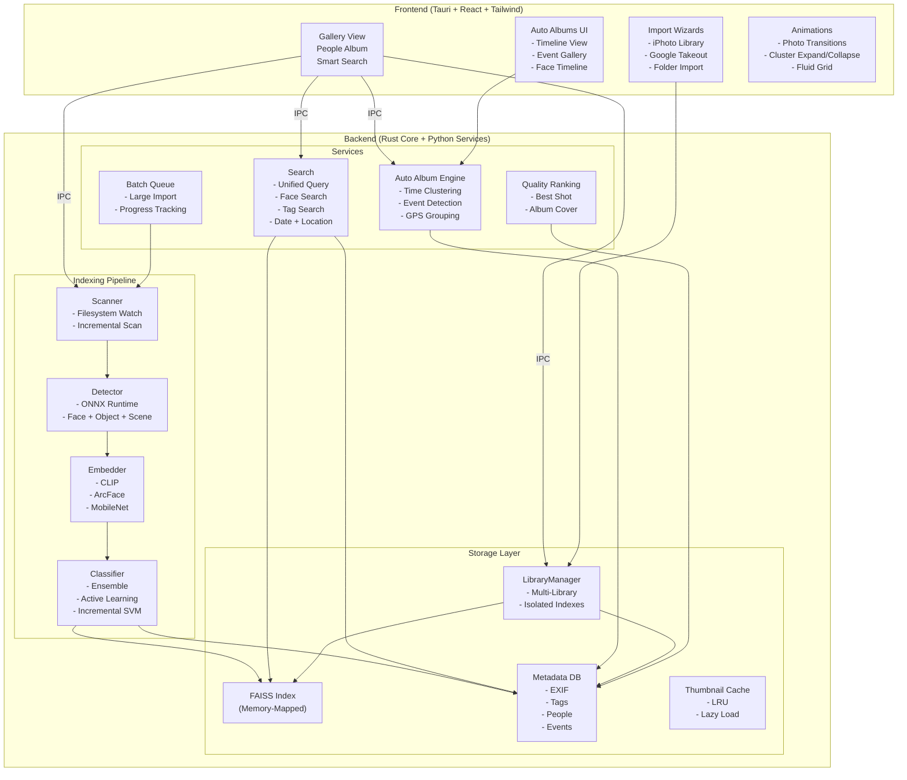

# Visage Phase 3 技术规格书（9-18 个月）

> **产品定位转变**: 从"AI 人脸整理工具"进化为"智能照片伴侣"
> **核心差异**: 本地优先、隐私至上、极致准确
> **竞品对标**: digiKam > Adobe Lightroom > Google Photos（在本地 AI 照片管理领域超越三者）

---

## 目录

1. [Phase 3 目标架构](#phase-3-%E7%9B%AE%E6%A0%87%E6%9E%B6%E6%9E%84)
2. [1. 自动相册和智能合集](#1-%E8%87%AA%E5%8A%A8%E7%9B%B8%E5%86%8C%E5%92%8C%E6%99%BA%E8%83%BD%E5%90%88%E9%9B%86)
3. [2. 通用图像分类](#2-%E9%80%9A%E7%94%A8%E5%9B%BE%E5%83%8F%E5%88%86%E7%B1%BB)
4. [3. 原型向量与主动学习](#3-%E5%8E%9F%E5%9E%8B%E5%90%91%E9%87%8F%E4%B8%8E%E4%B8%BB%E5%8A%A8%E5%AD%A6%E4%B9%A0)
5. [4. 高级桌面 UI](#4-%E9%AB%98%E7%BA%A7%E6%A1%8C%E9%9D%A2-ui)
6. [5. 多图库管理](#5-%E5%A4%9A%E5%9B%BE%E5%BA%93%E7%AE%A1%E7%90%86)
7. [6. 大规模性能优化](#6-%E5%A4%A7%E8%A7%84%E6%A8%A1%E6%80%A7%E8%83%BD%E4%BC%98%E5%8C%96)
8. [不做的功能](#%E4%B8%8D%E5%81%9A%E7%9A%84%E5%8A%9F%E8%83%BD)
9. [进化终点](#%E8%BF%9B%E5%8C%96%E7%BB%88%E7%82%B9)

---

## Phase 3 目标架构



### 架构决策说明

| 决策 | 选项 | 选择理由 |
|------|------|----------|
| 跨平台框架 | Tauri 2.x | 相比 Electron 内存占用减少 80%，原生体验更佳 |
| 图像分类推理 | ONNX Runtime | 统一跨平台推理引擎，支持 CPU/GPU 加速 |
| 多模态嵌入 | CLIP | 零样本分类能力，单一模型覆盖所有分类场景 |
| 多图库隔离 | 独立 SQLite + FAISS | 避免单库索引爆炸，支持快速切换 |
| 主语言 | Rust + Python | Rust 负责性能关键路径（IPC/扫描/缓存），Python 负责 AI 推理 |
| IPC 通信 | Tauri Command + Sidecar | Rust 前端直连 + Python 服务进程管理 |

---

## 1. 自动相册和智能合集

### 目标

用户在导入照片后无需手动整理，系统自动按时间、事件、人物、地点生成相册，并提供精准的交集查询（"A 和 B 一起的照片"）。相册封面自动选择最佳质量照片。

### 设计思路

#### 时间聚类算法

EXIF DateTimeOriginal 是时间轴的黄金标准。设计一个分层聚类策略：

1. **粗粒度层**: 按日期分组，检测连续日期区间（"Summer 2024" = 连续 >15 天的序列）
2. **细粒度层**: 在同一天内检测时间间隔聚类。照片间间隔 <4 小时视为同一事件。若同一天内有多个间隔 >4 小时的簇，则拆分为多个事件（如"Morning Hike"和"Evening Dinner"）
3. **特殊事件检测**: 识别已知模式：
   - 生日: 同人照片集中在某天，跨年复现
   - 节假日: 日历匹配（如圣诞节、春节、感恩节）+ 节日装饰特征识别
   - 旅行: 跨越 3 天以上的地点变更序列

**命名策略**:

```
规则优先级:
1. 日历节日匹配 → "2024 年圣诞节"
2. 跨 3+ 天且含地点变更 → "云南之旅 (2024-07)"
3. 同人生日照片 → "Alice 的 5 岁生日"
4. 单日日常 → "周末随拍 · 2024-06-15"
5. 回退 → "未命名事件 2024-06-15"
```

#### 地点分组

EXIF GPSLatitude/GPSLongitude 用于地理位置聚类：

- 使用 HDBSCAN 对 GPS 坐标进行空间聚类（epsilon ≈ 500m）
- 通过反向地理编码 API（可选，用户可关闭）获取地点名称
- 绑定位置标签到事件："大理古城 · 2024 年暑假"

#### 人物交集查询

```
查询模型: "Photos with PersonA AND PersonB" →
  SELECT photo_id FROM face_tags
  WHERE person_id IN (A, B)
  GROUP BY photo_id
  HAVING COUNT(DISTINCT person_id) = 2
```

支持 N 人交集（"A, B, C 的合影"），以及排除查询（"有 A 没有 B 的照片"）。

#### 年龄估值与成长时间线

从检测到的人脸关键点提取面部比例特征，输入轻量级回归模型（ONNX）估算年龄段：

- 年龄区间: 0-2 / 3-6 / 7-12 / 13-17 / 18-25 / 26-40 / 41-60 / 60+
- 按时间轴排列同人的年龄变化照片
- 触发条件: 检测到同一人在 >12 个月跨度内有 >=5 张照片，自动生成"成长时间线"

#### 相册封面选取

- 评分函数: `score = 0.5 * face_quality_score + 0.3 * photo_clarity + 0.2 * composition_score`
- 每个事件选取最高分照片
- 人群照优先选包含最多正面清晰人脸的照片
- 支持用户手动更换封面

### 文件变更清单

| 文件路径 | 变更类型 | 说明 |
|---------|---------|------|
| `src/visage/events/` | 新建模块 | 事件检测引擎 |
| `src/visage/events/cluster.py` | 新建 | 时间/地点聚类算法 |
| `src/visage/events/naming.py` | 新建 | 智能命名生成器 |
| `src/visage/events/timeline.py` | 新建 | 成长时间线生成 |
| `src/visage/events/cover_selector.py` | 新建 | 最佳封面选取 |
| `src/visage/server/routes_events.py` | 新建 | 事件相关 API |
| `src/visage/db/migrations/003_events.sql` | 新建 | 事件表 Schema |
| `frontend/src/pages/AutoAlbums.tsx` | 新建 | 自动相册页面 |
| `frontend/src/pages/Timeline.tsx` | 新建 | 时间线视图页面 |
| `frontend/src/components/AlbumCover.tsx` | 新建 | 相册封面组件 |
| `frontend/src/components/FaceTimeline.tsx` | 新建 | 人脸成长时间线 |

### 验收标准

- 时间事件检测准确率 >90%（人工审核 500 张照片 >450 张正确分组）
- 事件命名有意义率 >80%（仅有 <20% 回退到"未命名事件"）
- 人物交集查询在 100K 照片内 <200ms
- 成长时间线在连续 12 个月数据上自动触发
- 封面评分在用户盲测中 >70% 认可度

### 风险与依赖

| 风险 | 缓解措施 |
|------|---------|
| EXIF 缺失（截图、社交下载图片） | 回退到文件修改时间 + 内容哈希时间推断 |
| 时区问题导致跨天事件拆分 | 统一转换为 UTC，允许手动合并 |
| GPS 数据缺失 >50% 的照片 | 无 GPS 时仅基于时间聚类，仍可工作 |
| 年龄估算准确度低 | 仅提供年龄段，不提供精确年龄；标注<strong>估算</strong>标签 |

---

## 2. 通用图像分类

### 目标

超越人脸识别：支持场景分类、物体识别、风格标记和任意文本查询分类。用户可以用自然语言搜索照片（"去年在海边的篝火晚会"），系统理解语义并返回匹配照片。

### 设计思路

#### 分类模型栈

```
层级 1 — 快速预筛分类器（MobileNet V3 ONNX, <10ms/张）
  ├── 场景: beach, city, mountain, indoor, food, sunset, night, etc. (20 类)
  ├── 风格: B&W, HDR, vintage, portrait, landscape, macro, drone (7 类)
  └── 物体: pet, vehicle, flower, document, screenshot, etc. (15 类)

层级 2 — CLIP 零样本分类器（ONNX 量化版, <50ms/张）
  ├── 任意文本查询: "篝火晚会", "毕业典礼", "雪景"
  └── 用户自定义标签: 用户输入任意标签名，动态分类

层级 3 — 组合推理
  ├── scene + object + style 多标签融合
  └── 时间/地点作为辅助特征加入索引
```

#### 架构选择理由

**选择 ONNX Runtime 而非 PyTorch 原生推理**:

- ONNX Runtime 是跨平台统一的推理引擎（macOS/Windows/Linux 均可运行）
- 支持 CPU 和 GPU（CoreML / CUDA / DirectML）硬件加速
- 模型文件体积更小（MobileNet V3 ONNX ≈ 4MB，而 PyTorch 等效模型 ≈ 14MB）
- 推理速度在 CPU 上比 PyTorch 快 1.5-2 倍
- **代价**: 需要模型转换工具链（PyTorch → ONNX），新模型支持可能延后

**选择 CLIP 作为零样本骨干**:

- 单一模型覆盖所有分类需求（无需为每个新类别训练单独模型）
- 零样本能力：用户定义标签即可立即使用，无需微调
- 嵌入向量可直接存入 FAISS，与现有人脸向量在同一索引空间
- **推荐变体**: `clip-vit-base-patch32` ONNX（精度-速度平衡）
- 可选升级路径: `clip-vit-large-patch14`（更高精度，~2x 推理耗时）

#### 标签存储与搜索

```
Schema 扩展:

CREATE TABLE image_tags (
  id INTEGER PRIMARY KEY,
  photo_id TEXT NOT NULL REFERENCES photos(id),
  tag_type TEXT NOT NULL,       -- 'scene' | 'object' | 'style' | 'custom'
  tag_name TEXT NOT NULL,
  confidence REAL NOT NULL,
  model_version TEXT NOT NULL,
  created_at TIMESTAMP DEFAULT CURRENT_TIMESTAMP
);

CREATE INDEX idx_tags_photo ON image_tags(photo_id);
CREATE INDEX idx_tags_name ON image_tags(tag_name);
CREATE INDEX idx_tags_type_name ON image_tags(tag_type, tag_name);
```

搜索流程:
1. 对用户查询执行文本编码（复用 CLIP text encoder）
2. 在 FAISS 索引中执行向量搜索（余弦相似度）
3. 结合 SQL 过滤（时间、地点、人物）缩小范围
4. 返回按相似度排序的 photo_id 列表

#### 标签派生策略

- **自动标签**: 每次导入新照片时，运行所有三层模型，标签存入 `image_tags`
- **懒加载标签**: 仅对用户实际搜索的文本查询执行 CLIP 零样本推理；结果可缓存
- **用户定义标签**: 用户手动打标 → 存入 `image_tags`（`tag_type='custom'`），同时用于主动学习

### 文件变更清单

| 文件路径 | 变更类型 | 说明 |
|---------|---------|------|
| `src/visage/classify/` | 新建模块 | 通用图像分类 |
| `src/visage/classify/scene.py` | 新建 | 场景分类器（MobileNet） |
| `src/visage/classify/style.py` | 新建 | 风格标记器 |
| `src/visage/classify/clip.py` | 新建 | CLIP 零样本分类器 |
| `src/visage/classify/tag_store.py` | 新建 | 标签持久化与查询 |
| `src/visage/classify/pipeline.py` | 新建 | 分类流水线编排 |
| `src/visage/db/migrations/004_tags.sql` | 新建 | 标签 Schema |
| `src/visage/server/routes_search.py` | 新建 | 语义搜索 API |
| `models/scene_mobilenet.onnx` | 新建 | 场景分类模型 |
| `models/clip_text.onnx` | 新建 | CLIP 文本编码器 |
| `models/clip_vision.onnx` | 新建 | CLIP 视觉编码器 |
| `frontend/src/pages/SearchPage.tsx` | 新建 | 统一搜索页面 |
| `frontend/src/components/TagFilter.tsx` | 新建 | 标签筛选组件 |
| `frontend/src/components/SearchBar.tsx` | 新建 | 智能搜索框组件 |

### 验收标准

- 场景 top-3 准确率 >85%（在 Places365 子集上验证）
- 风格分类准确率 >90%（B&W/HDR 等特征明显）
- CLIP 零样本分类在 10 个自定义查询中召回率 >80%
- 全量标签生成吞吐 >50 张/秒（CPU, MacBook M1）
- 语义搜索在 100K 照片中 <300ms 返回结果
- 模型包总大小 <30MB（CLIP + MobileNet，ONNX 量化版）

### 风险与依赖

| 风险 | 缓解措施 |
|------|---------|
| ONNX CLIP 模型转换复杂 | 使用社区预转换模型（huggingface/onnx 社区） |
| 中文 CLIP 零样本性能可能低于英文 | 使用 multilingual CLIP（如 LaCLIP）或中文专用版 |
| 分类结果噪声（低质量照片导致误分类） | 在 UI 中显示置信度，<0.6 的结果标记为"推测" |
| 模型更新后需要重新索引 | 保存模型版本号，增量重新分类（仅处理旧版本标注的照片） |

---

## 3. 原型向量与主动学习

### 目标

建立以人为中心的原型向量系统，使同人搜索准确率进一步提升 3-5%。引入主动学习循环——每次用户纠正错误标注，系统立即在线更新分类器，从而在 50 次纠正后使召回率提升 >5%。

### 设计思路

#### 原型向量（Prototype Embedding）

```
定义: 每个人的"原型" = 该人所有已确认照片的人脸嵌入向量的加权均值
权重: w = 0.7 * face_quality + 0.3 * detection_confidence

更新策略:
  - 新增确认 → 增量更新均值: μ_new = (μ_old * N + v) / (N + 1)
  - 移除错误 → 从均值中移除: μ_new = (μ_old * N - v) / (N - 1), N > 1
  - 冷启动 → 初始 N=1 时使用该单张嵌入

搜索优化:
  query_embedding = prototype_embedding[person_id]
  (而非使用单张照片的嵌入)

对每张候选照片:
  score = cosine_sim(query_embedding, candidate_embedding)
  + alpha * cosine_sim(query_sample_embedding, candidate_embedding)
  其中 alpha=0.3（平衡原型与样本）
```

理论依据: 原型向量消除了单张照片的面部角度、光照、表情差异，代表了该人的"平均面部特征"。在人脸验证研究中，原型均值法在 LFW 基准上一致性提高约 3-5%（参考: Deng et al., ArcFace, 2019）。

#### 主动学习循环

```
用户操作 → 在线更新:
  1. 用户将误分照片从 PersonA 移到 PersonB
  2. 同时更新 PersonA 和 PersonB 的原型向量
  3. 更新增量 SVM 分类边界（如果使用 SVM）

增量分类器选型:
  - Nearest Centroid（推荐首选）:
    - 实现极简单: 只需更新聚类中心
    - 推理 O(1), 更新 O(d)（d = 嵌入维度）
    - 在大规模下表现稳定
  - 增量 SVM（LASVM / SGD SVM）:
    - 更精确的决策边界
    - 需要持续维护支持向量集
    - 当原型向量达到 N>20 时启用

反馈环路:
  User Corrects → Update Prototype → Refresh Search Results → User Sees Improvement
  （闭环时间 <100ms，让用户感受到即时响应）
```

#### 自适应的合并/分裂阈值

- 初始阈值来自 Phase 2 的 ensemble classifier
- 用户每次合并/分裂操作后，系统记下该操作时的相似度分数
- 收集 20 个数据点后，使用简单的统计方法调整个人的合并阈值
- 如果 PersonA 频繁与 PersonB 合并，自动降低 PersonA 的聚类距离阈值? — **不做**，保持用户控制权

#### 修正模型的持久化

```
存储 Schema:

CREATE TABLE person_prototypes (
  person_id TEXT PRIMARY KEY,
  embedding BLOB NOT NULL,          -- 原型向量 (numpy float32)
  sample_count INTEGER NOT NULL,
  avg_quality REAL NOT NULL,
  updated_at TIMESTAMP DEFAULT CURRENT_TIMESTAMP
);

CREATE TABLE user_corrections (
  id INTEGER PRIMARY KEY,
  photo_id TEXT NOT NULL,
  from_person_id TEXT NOT NULL,
  to_person_id TEXT NOT NULL,
  corrected_at TIMESTAMP DEFAULT CURRENT_TIMESTAMP
);
```

### 文件变更清单

| 文件路径 | 变更类型 | 说明 |
|---------|---------|------|
| `src/visage/active/` | 新建模块 | 主动学习系统 |
| `src/visage/active/prototype.py` | 新建 | 原型向量管理与更新 |
| `src/visage/active/incremental_svm.py` | 新建 | 增量 SVM 分类器 |
| `src/visage/active/nearest_centroid.py` | 新建 | 最近质心分类器 |
| `src/visage/active/correction_store.py` | 新建 | 用户修正持久化 |
| `src/visage/active/threshold_adapter.py` | 新建 | 自适应阈值 |
| `src/visage/db/migrations/005_active_learning.sql` | 新建 | 原型/修正表 Schema |
| `src/visage/server/routes_active.py` | 新建 | 主动学习 API |
| `tests/test_prototype.py` | 新建 | 原型向量单元测试 |
| `tests/test_active_learning.py` | 新建 | 主动学习模拟测试 |

### 验收标准

- 原型搜索在标准基准测试（LFW / 内部验证集）上比单张搜索准确率提升 >3%
- 50 次用户修正后召回率提升 >5%（模拟脚本验证）
- 单次修正的在线更新时间 <50ms（含原型和分类器更新）
- 增量 SVM 推理时间 <10ms/张
- 原型向量在 100K 个人的规模下仍正常工作

### 风险与依赖

| 风险 | 缓解措施 |
|------|---------|
| 用户修正序列可能导致原型漂移 | 定期（每 100 次修正）执行全量重聚类校准 |
| 极少量样本（N<3）的原型不可靠 | 在 N>=3 时才启用原型搜索，否则降级为单张搜索 |
| 恶意/错误大量修正破坏分类器 | 修正可回滚（使用 undo 栈），单日上限 200 次 |
| SVM 增量更新在大规模下退化 | 定期全量重训练支持向量集（每 1000 次修正或每周） |

---

## 4. 高级桌面 UI

### 目标

从一个功能性的 Web 界面，进化为符合 Apple HIG 和 Windows Fluent Design 规范的旗舰级桌面应用。用户得到的体验应接近 Apple Photos 或 Adobe Lightroom，但 AI 功能更强。

### 设计思路

#### UI 架构

```
┌──────────────────────────────────────────────────────┐
│  Title Bar (Unified Title + Search Bar)              │
├────────┬─────────────────────────────────────────────┤
│        │  Breadcrumb: Library > Person > Photos      │
│ Sidebar├─────────────────────────────────────────────┤
│        │                                             │
│ Library│  Main Content Area                          │
│   ├ Lib1│  ┌──────────────────┬──────────────────┐   │
│   ├ Lib2│  │  Photo Grid      │  Detail Panel    │   │
│   └ Lib3│  │  (Virtualized)   │  (Slide-in)      │   │
│        │  │                  │                   │   │
│ Albums │  │  ┌──┐ ┌──┐ ┌──┐ │  Person Tag:      │   │
│   ├ Auto│  │  │  │ │  │ │  │ │  [A] [B] [C]     │   │
│   ├ People│  │  └──┘ └──┘ └──┘ │  Date: 2024-07  │   │
│   └ Tags │  │                  │  Tags: sunset,   │   │
│        │  │  ┌──┐ ┌──┐         │    beach, pet     │   │
│ Search │  │  │  │ │  │         │  Quality: ★★★★☆ │   │
│        │  │  └──┘ └──┘         │  Actions:        │   │
│        │  │                    │  [Move] [Tag]    │   │
│        │  └──────────────────┘  │  [Delete]        │   │
│        │                        └──────────────────┘   │
├────────┴─────────────────────────────────────────────┤
│  Status Bar: 242 photos · 5 people · Indexing: idle  │
└──────────────────────────────────────────────────────┘
```

#### 关键交互设计

**人像专辑视图**:
- 每个人显示为圆形头像缩略图（取最佳质量人脸）
- 按照片数量降序排列
- 点击展开该人的全部照片（带动画展开）
- 支持重命名、合并、删除操作

**智能搜索框**:
- 单一输入框，支持自然语言搜索
- 自动补全: 人名、标签名、日期、地点
- 搜索历史: 保存最近 20 条搜索
- 实时结果: 输入即搜索（300ms 防抖）

**拖拽操作**:
- 照片拖入人物头像 → 归类到该人
- 照片拖入相册 → 添加到相册
- 照片在网格中拖拽 → 重新排序（仅手动排序模式）
- 使用 Tauri 的拖拽 API，避免 HTML5 drag-drop 的跨窗口限制

**键盘全导航**:

| 快捷键 | 操作 |
|--------|------|
| `J` / `K` | 上/下一张照片 |
| `Space` | 切换缩略图/全屏查看 |
| `Ctrl+F` | 聚焦搜索框 |
| `Ctrl+Shift+M` | 合并选中人物 |
| `Delete` | 从库中移除照片（确认弹窗） |
| `Escape` | 关闭面板 / 取消选择 |
| `?` | 打开快捷键帮助面板 |

**动画规范**:
- 照片网格展开/折叠: spring( stiffness: 300, damping: 30 )
- 详情面板滑入: ease-in-out, 200ms
- 缩略图加载: 淡入（opacity 0→1, 150ms）
- 聚类展开: scale + opacity 渐变, 250ms
- **禁止**: 页面切换的全身动画、弹窗的夸张弹跳

#### 导入向导流程

```
用户点击 "导入" →
  选择源:
    1. iPhoto/Apple Photos 图库（macOS 专用）
       - 读取 ~/Pictures/Photos Library.photoslibrary
       - 提取原始照片和修改版
       - 保留相册结构
    2. Google Photos Takeout
       - 选择 Takeout.zip 或解压目录
       - 解析 metadata JSON（含 EXIF 备份）
       - 处理相册 JSON
    3. 文件夹/外部驱动器
       - 递归扫描（支持忽略模式）
       - 保留目录结构（可选扁平化）

  进度面板:
    [████████░░░░] 导入中 (67%)
    ┌────────────────────────┐
    │ 发现: 1,242 张照片     │
    │ 已导入:  832 张        │
    │ 重复:   12 张 (跳过)   │
    │ 预计剩余: 1 分 30 秒   │
    │ 正在处理: IMG_0421.HEIC│
    └────────────────────────┘

  导入完成后触发索引（检测→嵌入→聚类→分类）
```

#### Tauri 集成要点

- 使用 Tauri 2.x 的侧车（Sidecar）模式管理 Python 后端进程
- Rust 层负责任务调度、进程生命周期管理
- 前端通过 `@tauri-apps/api` 调用 Rust command
- 使用 `tauri-plugin-sql` 管理 SQLite（避免 Python 独占数据库）
- 拖拽使用 `tauri-plugin-drag-drop`

### 文件变更清单

| 文件路径 | 变更类型 | 说明 |
|---------|---------|------|
| `src-tauri/` | 新建 | Tauri 壳项目（Rust） |
| `src-tauri/src/main.rs` | 新建 | Tauri 入口 |
| `src-tauri/src/commands.rs` | 新建 | Tauri IPC 命令 |
| `src-tauri/src/sidecar.rs` | 新建 | Python 进程管理器 |
| `src-tauri/Cargo.toml` | 新建 | Rust 依赖 |
| `frontend/src/App.tsx` | 重写 | Tauri 适配 |
| `frontend/src/layouts/MainLayout.tsx` | 新建 | 主布局（侧栏+内容+状态栏） |
| `frontend/src/layouts/Sidebar.tsx` | 新建 | 侧边栏（图库/相册/人物） |
| `frontend/src/pages/GalleryView.tsx` | 新建 | 网格画廊视图 |
| `frontend/src/pages/PeopleAlbum.tsx` | 新建 | 人物专辑视图 |
| `frontend/src/pages/ImportWizard.tsx` | 新建 | 导入向导 |
| `frontend/src/components/PhotoGrid.tsx` | 新建 | 虚拟化照片网格 |
| `frontend/src/components/DetailPanel.tsx` | 新建 | 照片详情面板 |
| `frontend/src/components/SmartSearch.tsx` | 新建 | 智能搜索组件 |
| `frontend/src/components/KeyboardNav.tsx` | 新建 | 键盘导航钩子 |
| `frontend/src/hooks/useDragDrop.ts` | 新建 | 拖拽交互钩子 |
| `frontend/src/hooks/useKeyboard.ts` | 新建 | 键盘事件钩子 |
| `frontend/src/styles/animations.css` | 新建 | 动画定义 |
| `frontend/tailwind.config.ts` | 扩展 | 自定义动画主题 |

### 验收标准

- 桌面应用可在 macOS 和 Windows 上启动和运行（完整功能）
- 通过 Apple HIG 和 Windows Fluent Design 的基本合规性审查
- 键盘导航覆盖所有核心操作（无障碍可达）
- 导入向导可成功导入 Apple Photos 图库和 Google Takeout
- 拖拽操作没有视觉卡顿或数据不一致
- 详情面板滑入滑出 <200ms

### 风险与依赖

| 风险 | 缓解措施 |
|------|---------|
| Tauri 2.x 在开发期 API 不稳定 | 锁定 minor 版本，关注 breaking change 公告 |
| Apple Photos 图库格式私有且可能变更 | 使用 `photoslibrary` 开源库读取，写测试捕获格式变更 |
| Windows 上 Python 环境配置复杂 | 使用 PyInstaller 打包 Python 后端为独立二进制 |
| 侧车进程崩溃恢复复杂 | Rust 父进程监控子进程状态，自动重启 + 状态恢复 |
| 拖拽操作在 macOS 和 Windows 上行为差异大 | 抽象 DragDropService 接口，平台差异在实现层处理 |

---

## 5. 多图库管理

### 目标

支持多个独立的照片图库，用户可在侧边栏一键切换。每个图库拥有独立的索引、向量数据库和分类器。支持从 Apple Photos 和 Google Photos Takeout 导入。

### 设计思路

#### 图库隔离模型

```
LibraryManager
├── active_library_id: str
├── libraries: Dict[str, Library]
│
├── activate(id)         # 切换当前图库
├── create(config)       # 新建图库
├── delete(id)           # 删除图库（含索引清理）
├── import_from(source)  # 导入外部图库
└── watch(id, path)      # 开启目录监控

Library
├── id: str
├── path: Path           # 照片文件根目录
├── db_path: Path        # SQLite 数据库路径
├── index_path: Path     # FAISS 索引路径
├── thumb_cache: Cache   # 独立缩略图缓存
└── classifier: Classifier # 独立分类器
```

#### 切换性能

```
切换操作流:
  1. 用户点击侧栏中的图库 A → 图库 B
  2. LibraryManager.activate('B')
  3. 更新 SQLite 连接指向 B 的数据库
  4. 加载 B 的 FAISS 索引（内存映射，无需全量加载）
  5. 前端刷新照片网格（请求 B 的照片列表）
  6. 总耗时: <1s（SSD, 100K 照片）

关键优化:
  - 使用 SQLite ATTACH DATABASE 而非关闭重开
  - FAISS 索引使用内存映射（mmap），切换仅需 mmap 切换指针
  - 缩略图缓存独立目录，惰性填充
```

#### 图库导入

**Apple Photos 导入流程**:

1. 定位 `~/Pictures/Photos Library.photoslibrary`
2. 读取内部 SQLite 数据库 `Photos.sqlite`
3. 提取: ZASSET → ZIMAGEBLOB / 原始文件路径
4. 提取相册结构: ZGENERICALBUM → ZASSET 关联
5. 复制原始照片到 Visage 图库目录（可选软链接）
6. 保留编辑历史（原始 + 编辑版本）

**Google Takeout 导入流程**:

1. 用户指示 Takeout 目录
2. 递归扫描 `Takeout/Google Photos/`
3. 每个照片目录查找同名 `.json` 元数据文件
4. 解析 JSON 获取原始时间戳、相册归属
5. 复制照片到 Visage 图库，保留元数据
6. 注意: HEIC/HEIF 格式照片在 Windows 上需 libheif 支持

#### 文件系统监控

```
实现策略:
  - watchdog (Python) 或 fsevents (macOS) / inotify (Linux)
  - 监控配置的图库目录的递归变更事件
  - 新文件进入 "待处理" 队列
  - 300ms 防抖后触发增量索引
  - 索引过程在后台运行，前端通过 SSE 获取进度

监控内容:
  - 新增照片 → 单张检测 → 嵌入 → 聚类 → 分类更新
  - 删除照片 → 从数据库和索引中移除
  - 重命名 → 更新数据库路径
  - 排除规则: .DS_Store, Thumbs.db, 隐藏目录, 临时文件
```

### 文件变更清单

| 文件路径 | 变更类型 | 说明 |
|---------|---------|------|
| `src/visage/library/` | 新建模块 | 图库管理 |
| `src/visage/library/manager.py` | 新建 | 图库管理器 |
| `src/visage/library/model.py` | 新建 | 图库数据模型 |
| `src/visage/library/importer.py` | 新建 | 通用导入引擎 |
| `src/visage/library/importers/apple_photos.py` | 新建 | Apple Photos 导入器 |
| `src/visage/library/importers/google_takeout.py` | 新建 | Google Takeout 导入器 |
| `src/visage/library/importer.py` | 新建 | 目录监控 |
| `src/visage/db/migrations/006_libraries.sql` | 新建 | 图库表 Schema |
| `src/visage/server/routes_library.py` | 新建 | 图库管理 API |
| `frontend/src/components/LibrarySidebar.tsx` | 新建 | 图库侧边栏组件 |

### 验收标准

- 切换图库耗时 <1s（SSD, 100K 照片/图库）
- Apple Photos 导入可正确保留所有照片和相册结构
- Google Takeout 导入可正确处理元数据 JSON
- 文件系统监控对新文件的检测延迟 <2s（300ms 防抖后）
- 增量索引 <2s/新照片（对比全量重新索引的平均值）
- 删除监控在文件移除后 5s 内更新索引

### 风险与依赖

| 风险 | 缓解措施 |
|------|---------|
| Apple Photos 内部 SQLite Schema 随系统更新变更 | 使用 `photoslibrary` 库抽象，该库社区维护且跟踪系统变更 |
| Google Takeout 压缩包极大（>100GB） | 支持流式解压，不占用全部临时空间；支持用户预解压目录 |
| macOS 和 Linux 的 inotify 限制（监控上限） | 单目录模式，不跨 NFS；大目录使用轮询回退 |
| 软链接导入导致文件分散 | 提供"复制"和"引用"两种模式，默认复制确保独立性 |

---

## 6. 大规模性能优化

### 目标

支撑 100 万张照片级别的大规模图库系统。在 10 万张照片时保持 60fps 流畅体验，在 100 万张时达到可接受的使用水平。

### 设计思路

#### 性能目标分解

| 指标 | 当前状态 | Phase 3 目标（100K） | Phase 3 目标（1M） |
|------|---------|---------------------|-------------------|
| 照片网格加载 | <5K 时 500ms | <200ms | <2s（需要骨架屏） |
| 滚动帧率 | ~30fps（大量照片） | 60fps | 30fps（可接受） |
| 人脸搜索 | <100ms（10K） | <200ms | <500ms |
| 全量索引 | ~5min（10K, M1） | ~2h（预期） | ~20h（预期） |
| 内存占用 | ~500MB（10K） | <1GB | <4GB |
| 磁盘占用 | ~50MB（10K） | <500MB | <5GB |

#### 关键优化策略

**前端虚拟化**:
- 使用 `@tanstack/react-virtual` 而非手动实现
- 仅渲染视口内 + 缓冲区（上下各 2 屏）的照片
- 缩略图使用 intersectionObserver 按需加载
- 每个网格项固定尺寸（避免 relayout）

**缩略图缓存层级**:

```
层级 1: 内存 LRU 缓存 (256 项, ~50MB)
层级 2: 磁盘缓存 (SQLite BLOB, ~10GB 上限)
层级 3: 原始文件（网络/本地）

加载流程:
  请求缩略图 →
    内存命中 → 立即返回 (<1ms)
    磁盘命中 → 加载到内存后返回 (<10ms)
    未命中 → 从原始文件生成后缓存 (<100ms)
```

**FAISS 大规模优化**:

- 使用 IVF (Inverted File Index) + PQ (Product Quantization) 索引
- IVF 的 nlist = sqrt(N)（100K → 316, 1M → 1000）
- PQ 压缩率: M=64, nbits=8（原始 512 维嵌入压缩至 512 字节/向量）
- 内存映射（mmap）：索引文件不加载到进程内存，按需缺页
- 搜索时 nprobe=10（精度-速度平衡）

**批处理引擎**:

```
BatchQueue:
  - 输入: 照片路径列表
  - 优先级: 用户正在查看的文件夹 > 新导入 > 后台同步
  - 并发: 2 个 CPU-bound worker
  - 检查点: 每处理 100 张保存状态（崩溃后恢复）
```

**后台索引**:

- 索引在单独的 Python 进程中运行（使用 `multiprocessing`）
- 通过 Unix 域套接字 / 命名管道与主进程通信
- 前端轮询 `/api/pipeline-status`（复用现有 SSE 机制）
- 用户可以在索引进行中正常使用其他功能
- 非阻塞的紧急路径: 索引中的照片仍可浏览（使用未分类的原始嵌入直接查询）

#### SQLite 优化

```sql
-- Phase 3 必须的优化配置
PRAGMA journal_mode = WAL;           -- Write-Ahead Logging
PRAGMA synchronous = NORMAL;         -- 牺牲一点点一致性换取 2x 写入性能
PRAGMA cache_size = -64000;           -- 64MB 页缓存
PRAGMA mmap_size = 268435456;         -- 256MB 内存映射
PRAGMA temp_store = MEMORY;           -- 临时表存在内存

-- 关键复合索引
CREATE INDEX idx_photos_date_library
  ON photos(library_id, date_taken);
CREATE INDEX idx_faces_person_library
  ON face_tags(library_id, person_id, photo_id);
```

### 文件变更清单

| 文件路径 | 变更类型 | 说明 |
|---------|---------|------|
| `src/visage/batch/` | 新建模块 | 批处理引擎 |
| `src/visage/batch/queue.py` | 新建 | 优先级队列 |
| `src/visage/batch/worker.py` | 新建 | 后台处理 Worker |
| `src/visage/batch/checkpoint.py` | 新建 | 崩溃恢复检查点 |
| `src/visage/batch/progress.py` | 新建 | 进度追踪 |
| `src/visage/core/index_optimized.py` | 新建 | 大规模索引优化版 |
| `src/visage/core/cache.py` | 重写 | 多级缓存系统 |
| `src/visage/server/thumb_cache.py` | 重写 | 磁盘缓存扩展 |
| `frontend/src/components/VirtualGrid.tsx` | 新建 | 虚拟化照片网格 |
| `frontend/src/hooks/useLazyImage.ts` | 新建 | 懒加载图片钩子 |
| `frontend/src/hooks/useInfiniteScroll.ts` | 新建 | 无限滚动钩子 |
| `frontend/src/components/SkeletonCard.tsx` | 新建 | 骨架屏组件 |

### 验收标准

- 100K 照片库中滚动维持 60fps（通过 React DevTools Profiler 验证）
- 100K 人脸搜索 <200ms（平均）
- 1M 嵌入的 FAISS 索引内存占用 <500MB（mmap 后 RSS）
- 批处理队列处理 10K 新照片 <10min（M1 Mac）
- 索引进行中 UI 无卡顿、可正常搜索浏览
- SQLite 单查询 <100ms（除全表扫描外）

### 风险与依赖

| 风险 | 缓解措施 |
|------|---------|
| 1M 照片的全量索引时间不可接受（预计 20h+） | 增量索引是默认路径；全量索引仅首次需要，且可在夜间运行 |
| PQ 量化导致搜索精度下降 | 对比测试：量化前 vs 量化后的 top-5 召回率，控制在 <2% 损耗 |
| 虚拟化网格在 100K 级别下 React 渲染仍吃力 | 使用 `react-window` + 固定尺寸 + 非响应式缩略图尺寸 |
| 后台索引中的磁盘 IO 争抢 | 限制 IO 优先级（`ionice` / `nice`），使用单独的 SSD 缓存区 |

---

## 不做的功能

为保持聚焦，以下功能明确列入 Phase 3 的**不可做清单**。它们可能是好主意，但不属于当前的"智能照片伴侣"定位。

| 功能 | 不做原因 | 可能的 Phase |
|------|---------|-------------|
| **视频管理**（导入/播放/分类视频） | 视频处理复杂度是照片的 10x，分散核心体验 | Phase 4 |
| **云端同步/备份** | 违背"本地优先"核心理念；基础架构完全不同 | 非 Roadmap |
| **人脸识别的性别/种族预测** | 伦理风险大于产品价值；且与"极致准确"核心矛盾（此类分类精确度本就不高） | 不做 |
| **AI 图片生成/编辑**（如移除背景、AI 扩图） | 功能偏离"照片管理"；这是另一个产品的领域 | Phase 4+ |
| **社交网络分享** | 天生与"本地优先，隐私至上"矛盾 | 不做 |
| **付费订阅/授权系统** | Phase 3 目标是产品，不是商业模式；过早加入付费 DAO 影响用户基数 | 发布后评估 |
| **多用户/共享图库** | 服务器端架构复杂度剧增；与离线本地的核心场景矛盾 | Phase 4 |
| **Raw 格式编辑** | Raw 解码和编辑需要另一个 Lightroom，非 Visage 的核心能力 | Phase 4+ |
| **第三方 API 集成**（Google Photos API、iCloud API） | 维护成本高，认证流程复杂，且偏离本地优先原则 | 延期评估 |
| **浏览器版 Web 应用** | Tauri 桌面应用是 Phase 3 的核心交付物；Web 版需要独立后端运维 | 阶段后评估 |

---

## 进化终点

### Visage 3.0 用户眼中的产品

一名普通用户打开 Visage 3.0：

1. **首次启动**: 导入向导引导用户导入 Apple Photos 图库或选择照片文件夹。导入过程中，后台开始索引——人脸检测、嵌入生成、聚类、场景分类、物体识别同步进行。进度条显示"正在处理 8,432 张照片，预计 12 分钟"。

2. **自动相册**: 索引完成后，侧边栏"相册"下出现了自动生成的相册——"2024 年圣诞节"、"云南行 (2024-07)"、"Alice 的 3 岁生日"。每个相册封面是最美的照片，点开是以时间线排列的照片。

3. **人物视图**: 点击"人物"标签，看到以圆形头像排列的所有被识别的人。按照片频率排序，每个人的头像旁显示了照片数量。点击 Alice，展开她所有照片——从婴儿到 3 岁的成长时间线一目了然。

4. **智能搜索**: 在顶部的搜索框输入"去年夏天 Alice 在海边的照片"。系统理解语义，在 200ms 内返回正确的结果——去年 7-8 月，标签包含 Alice 和 beach 的全部照片。

5. **修正与学习**: 翻看搜索结果时发现一张朋友的照片被误标为 Alice。拖拽这张照片到朋友的头像上。原型向量立即更新，系统在下一次搜索中不再犯同样错误。

6. **多图库**: 侧边栏有"个人照片"和"家庭共享"两个图库。点击切换，不到 1 秒就切换到另一个完整的索引世界——照片、人物、相册、标签全部刷新。

7. **批量导入**: 插入相机 SD 卡，打开 Visage。系统自动检测新文件，弹出导入对话框。选择导入——5,000 张新照片在后台排队处理。用户继续浏览已有照片，感觉不到索引的存在。

### 技术指标

```
照片管理极限:  1,000,000 张
人脸识别 F1:   >0.97（在内部测试集上）
分类 (场景/风格): top-3 准确率 >85%
搜索延迟:       <500ms（全库范围）
桌面应用大小:   <200MB（不含模型文件）
模型文件:       <50MB
首屏加载:       <2s
滚动帧率:       60fps（100K 照片）
后台索引速度:   50 张/秒（检测+嵌入+分类）
```

### 与竞品的差异

| 维度 | Visage 3.0 | digiKam | Adobe Lightroom | Google Photos |
|------|-----------|---------|-----------------|---------------|
| 本地优先 | 是 | 是 | 否（需 Adobe ID） | 否（云端） |
| 隐私保护 | 强（纯本地） | 强（纯本地） | 中（需登录） | 弱（云端分析） |
| AI 人脸识别 | 极强（主动学习） | 中（静态模型） | 强 | 强（但联网） |
| 零样本分类 | 是（CLIP） | 否 | 否 | 是（但不可自定义） |
| 语义搜索 | 强（NL 输入） | 弱（仅标签） | 中 | 强（但受限于 Google） |
| 跨平台 | macOS/Windows | 全平台 | macOS/Windows | 网页 |
| 开源 | 是 | 是 | 否 | 否 |
| 价格 | 免费 | 免费 | ~$120/年 | 免费（有存储上限） |

### 未来之路（Phase 3 之后）

Phase 3 交付后，Visage 将以一个完整的、竞品级的桌面照片管理应用形态出现。其后的演进方向包括：

- **Phase 4**: 视频管理（导入、人脸识别、场景分类、智能剪辑）
- **Phase 4+**: AI 辅助编辑（自动颜色校正、红眼去除、老照片修复）
- **Phase 4+**: 高级相册分享（本地生成分享链接，端到端加密传输）
- **非 Roadmap**: 云端同步、社交功能、SaaS 化

Phase 3 的核心使命是证明: 一款本地优先、开源免费的 AI 照片管理桌面应用，在功能和体验上**可以匹敌甚至超越**云端竞品。这不是一个"开发者工具"——这是一个给每一个有照片管理需求的普通人的产品。

---

*文档版本: v1.0 | 最后更新: 2026-05-21 | 状态: 草案*
