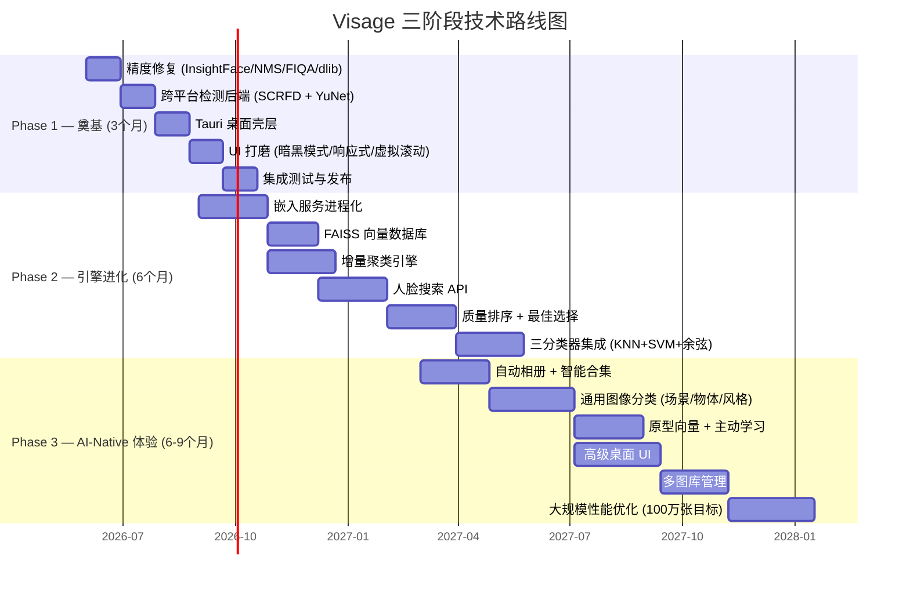

# Visage 技术路线图总索引

> **最终目标**：本地优先、极致聚焦人像整理 → 扩展到通用图片分类的跨平台桌面客户端软件
> **文档版本**：v1.0 | **更新日期**：2026-05-21

---

## 路线图总览



---

## 产品进化轨迹

```
当前 (v0.x)                    Phase 1 (v1.0)               Phase 2 (v2.0)
┌─────────────────────┐    ┌─────────────────────┐    ┌─────────────────────┐
│ CLI 工具            │    │ 桌面应用 (Tauri)    │    │ 实时 AI 照片引擎    │
│ macOS only          │    │ macOS + Windows     │    │ 全平台支持          │
│ 全量批处理           │    │ 精度修复 ✓          │    │ 增量处理 ✓          │
│ 364+ Python 测试    │    │ 暗黑模式 ✓           │    │ 人脸搜索 ✓          │
│ Web UI 预览         │    │ 跨平台检测 ✓         │    │ 质量排序 ✓          │
│                     │    │ 虚拟滚动 ✓           │    │ 集成分类 ✓          │
└─────────────────────┘    └─────────────────────┘    └─────────────────────┘

                             继续进化为...
                             Phase 3 (v3.0)
                             ┌─────────────────────┐
                             │ 智能照片伴侣         │
                             │ 自动相册 ✓           │
                             │ 通用分类 ✓           │
                             │ 主动学习 ✓           │
                             │ 多图库管理 ✓         │
                             │ 100万+ 照片 ✓        │
                             └─────────────────────┘
```

---

## 三阶段核心指标

| 指标 | 当前 | Phase 1 目标 | Phase 2 目标 | Phase 3 目标 |
|------|------|-------------|-------------|-------------|
| 检测精度 (mAP) | ~未知 | >90% | >92% | >95% |
| 聚类纯度 | ~未知 | >95% | >97% | >98% |
| Top-5 搜索命中率 | 无此功能 | - | >95% | >97% |
| 最大照片库 | ~10K | ~50K | ~100K | ~1M |
| 新照片处理延迟 | 全量重跑 | 全量重跑 | <200ms/张 | <100ms/张 |
| 平台支持 | macOS | macOS + Windows | 全平台 | 全平台 |
| 交付形态 | CLI | Tauri 桌面 | Tauri 桌面 | Tauri 桌面 |

---

## 各阶段 SPEC 文档

| 阶段 | 文档 | 行数 | 核心交付 | 工期 |
|------|------|------|---------|------|
| **Phase 1** | [`PHASE1-SPEC.md`](./PHASE1-SPEC.md) | 713 | 精度修复 + 跨平台检测 + Tauri壳层 + UI打磨 | 12周 |
| **Phase 2** | [`PHASE2-SPEC.md`](./PHASE2-SPEC.md) | 617 | 嵌入服务 + FAISS + 增量聚类 + 人脸搜索 + 质量排序 + 集成分类 | 24周 |
| **Phase 3** | [`PHASE3-SPEC.md`](./PHASE3-SPEC.md) | 897 | 自动相册 + 通用分类 + 主动学习 + 高级UI + 多图库 + 100万级性能 | 36周 |

### 快速跳转

- [Phase 1 详细规格](./PHASE1-SPEC.md)
- [Phase 2 详细规格](./PHASE2-SPEC.md)
- [Phase 3 详细规格](./PHASE3-SPEC.md)

---

## Phase 1：奠基（12 周）

**核心命题**：从 macOS-only CLI 原型进化为可交付的跨平台桌面应用。

| 阶段 | 交付物 | 工期 | 关键文件 |
|------|--------|------|---------|
| M1 | 精度修复（NMS、FIQA、InsightFace _crop_face、dlib 零填充） | 2周 | `detector.py`, `backends.py`, `models.py` |
| M2 | 跨平台检测后端（SCRFD + YuNet，DetectorBackend 抽象层） | 2周 | `detector.py`, `backends.py`, `config.py` |
| M3 | Tauri v2 桌面壳层（侧车进程、系统托盘、自动更新） | 4周 | `src-tauri/` 全新 |
| M4 | UI 打磨（响应式布局、暗黑模式、虚拟滚动、批量操作） | 2周 | 前端组件 |
| M5 | 集成测试、跨平台 CI、安装包构建、基准测试 | 2周 | `.github/` CI，构建脚本 |

**风险**：Tauri 侧车进程稳定性和 Python 环境分发；跨平台检测精度一致性。

---

## Phase 2：引擎进化（24 周）

**核心命题**：从"每次运行重新计算"的批处理管道 → 持续运行的持久化引擎。

| 交付物 | 工期 | 关键架构变化 |
|--------|------|-------------|
| 嵌入服务进程化 | 8周 | 独立 Python 进程，GPU加速，请求队列 |
| FAISS 向量数据库 | 6周 | 从内存 numpy → 磁盘索引，IVF/HNSW |
| 增量聚类引擎 | 8周 | 最近邻分配 + 周期性 HDBSCAN 漂移修正 |
| 人脸搜索 API | 8周 | `/api/search/face` FAISS ANN，Top-5 >95% |
| 质量排序 + 最佳选择 | 8周 | FIQA + 表情/清晰度评分 |
| 三分类器集成 | 8周 | KNN + SVM + 余弦距离交叉验证 |

**风险**：增量聚类在极端分布下可能漂移；FAISS 索引版本管理；GPU 加速的跨平台兼容性。

---

## Phase 3：AI-Native 体验（36 周）

**核心命题**：从"AI 人脸整理工具"进化为"智能照片伴侣"。

| 交付物 | 工期 | 核心能力 |
|--------|------|---------|
| 自动相册与智能合集 | 8周 | 时间聚类、事件检测、GPS 分组、年龄估计 |
| 通用图像分类 | 10周 | 场景分类、物体识别、风格标签、CLIP零样本 |
| 原型向量 + 主动学习 | 8周 | 平均原型嵌入、增量 SVM、用户反馈飞轮 |
| 高级桌面 UI | 10周 | Gallery视图、统一搜索、导入向导、动画 |
| 多图库管理 | 8周 | 独立索引、Apple Photos/Google Takeout 导入 |
| 大规模性能优化 | 10周 | 100万照片目标、mmap FAISS、后台索引 |

**不做的功能**：视频管理、云端同步、社交媒体分享、订阅收费、多人协作。

---

## 竞争定位

```
                 功能广度
                     ↑
          Immich ●  │  ● Adobe Lightroom
                   │
          Google ●  │
          Photos   │
                   │
                   │
  Visage v3.0 ●    │
                   │
  Visage v1.0 ●    │
                   │
                   └─────────────────────→ 本地优先 + 隐私
                   低                    高
```

Visage 的长期竞争力：在"本地优先、极致精度、聚焦人脸+图片分类"这个极窄但高价值的垂直领域做到全球最高水平。

---

## 如何阅读各阶段 SPEC

每个阶段 SPEC 的交付项都遵循统一结构：

1. **目标** — 解决什么问题、为什么重要
2. **设计思路** — 详细方案和架构决策理由
3. **文件变更清单** — 具体要创建/修改的文件
4. **验收标准** — 可衡量的通过条件
5. **风险与依赖** — 可能出错的地方和前置条件

建议阅读顺序：
1. 先通读本索引 SPEC-INDEX.md 了解全貌
2. 再按 PHASE1 → PHASE2 → PHASE3 顺序阅读各阶段细节
3. 遇到具体实施问题时回到对应阶段查看验收标准
