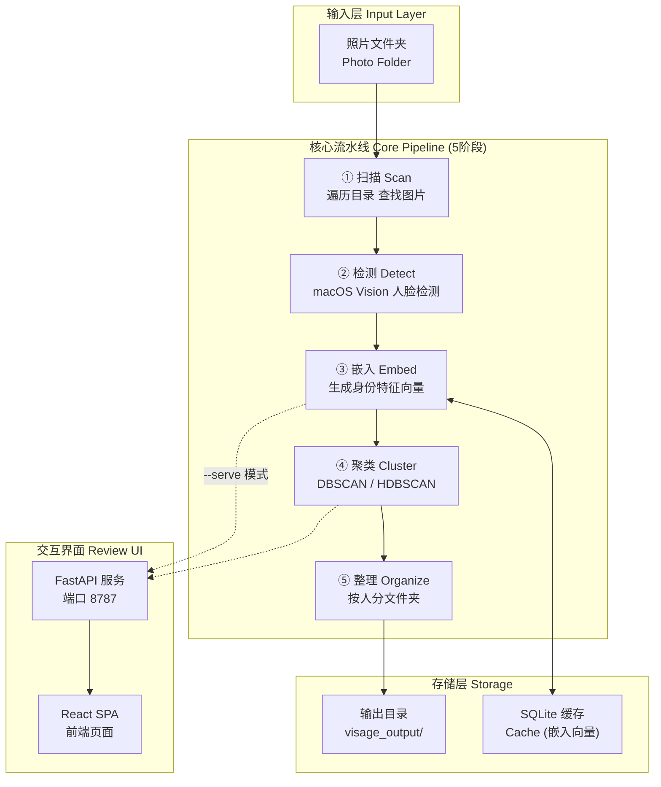
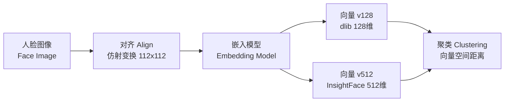
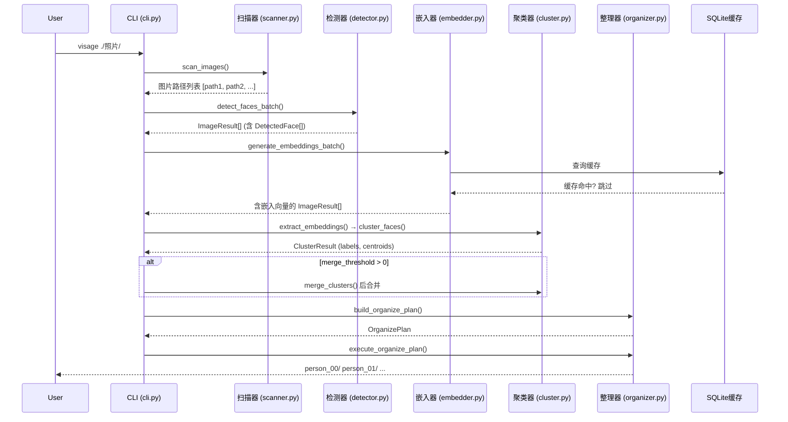
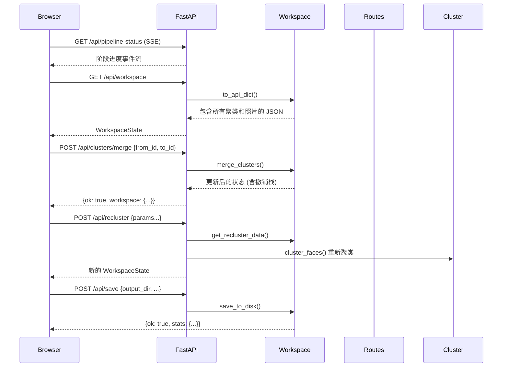
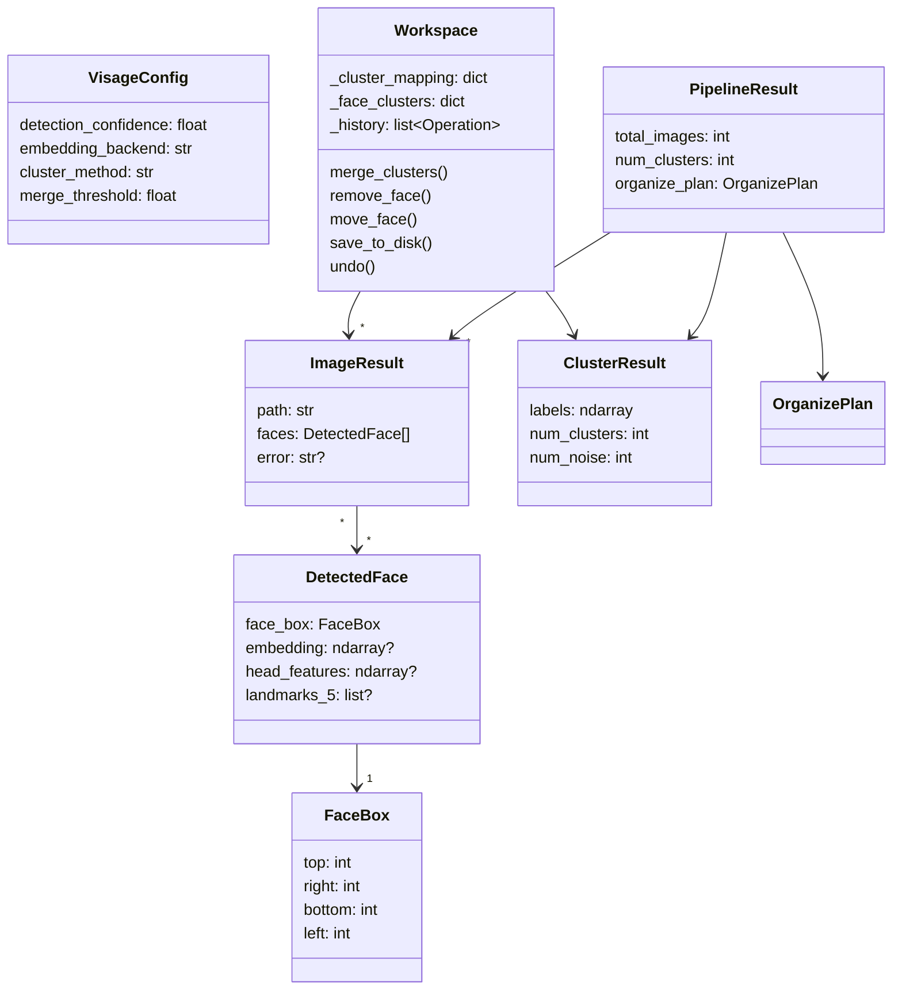
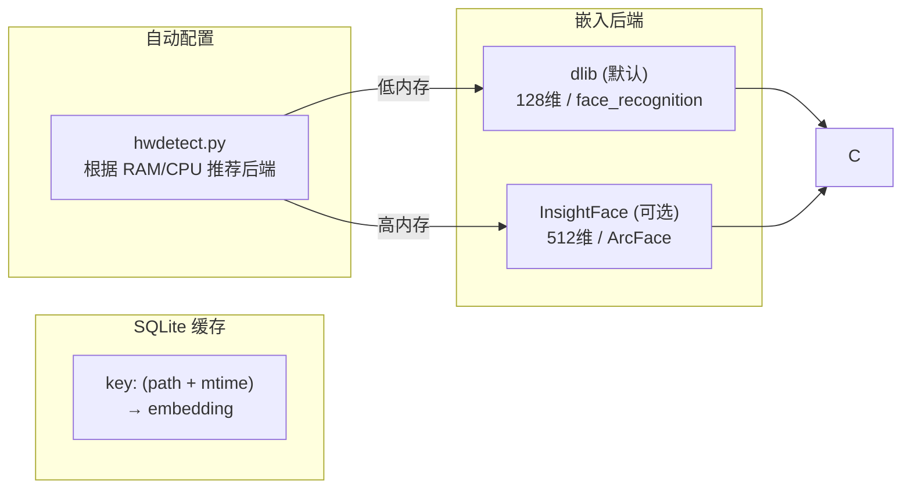

# Visage Architecture

> macOS-native face clustering and photo sorting — from raw photos to organized folders, with an interactive review UI.



## 核心概念 Core Concepts

### 为何选择 macOS Vision 框架？

Visage 使用 macOS 原生的 Vision 框架进行人脸检测，而非 OpenCV 或深度学习模型：

- **硬件加速** — Vision 框架调用 Apple Neural Engine，速度优于纯软件方案
- **零模型依赖** — 无需下载或管理额外模型文件
- **高精度** — Apple 的检测器在大姿态、遮挡和光照变化下表现稳定

检测到的面部信息包括：
- **边界框** — 像素坐标 (top, right, bottom, left)
- **5点特征点** — 双眼、鼻尖、嘴角 (用于对齐)
- **头部轮廓** — 用于修正边界框，避免截断头顶/下巴

### 嵌入向量的作用



嵌入向量将人脸转换为数学表示：同一人的不同照片在向量空间中距离近，不同人的距离远。这是聚类的基础。

### 聚类的两个阶段

```
阶段一：初始聚类 (DBSCAN/HDBSCAN)
  ┌─────┐  ┌─────┐  ┌─────┐
  │  A  │  │  A  │  │  B  │  ← 可能过度分割
  │ 集群1│  │ 集群2│  │ 集群3│      (同人不同组)
  └─────┘  └─────┘  └─────┘
      │        │
      └────────┘
          │
          ▼
阶段二：后聚类合并 (余弦相似度)
  ┌─────────┐  ┌─────┐
  │    A    │  │  B  │  ← 合并后
  │  集群1  │  │ 集群3│
  └─────────┘  └─────┘
```

## 数据流 Data Flow

### 5阶段流水线详解



### Web UI 模式下的交互



## 组件关系 Component Relationships



## 关键设计决策 Key Design Decisions

### 1. 内存优先的内存模型

Workspace 类完全在内存中运行，不使用外部数据库：
- **优势**：零延迟操作、简单撤销实现（快照模式）
- **劣势**：数据集超大时可能受限
- **缓解**：sample_limit 配置项控制最大人脸数

### 2. 撤销栈 = O(1) 快照

每次修改操作前，Workspace 保存受影响数据的快照（而非完整状态）。撤销时直接恢复快照：

```
merge_clusters(from=1, to=2):
  1. 保存: {from_id: 1, to_id: 2, from_photos: [...], face_snapshot: {...}}
  2. 合并: _cluster_mapping[2] += _cluster_mapping[1]
  3. 删除: del _cluster_mapping[1]

undo():
  1. 弹出: {from_id: 1, ...}
  2. 恢复: _cluster_mapping[1] = from_photos
  3. 还原: _cluster_mapping[2] = to_photos_before
```

### 3. 人脸级别的聚类追踪

传统聚类按图片追踪（一张图 = 一个标签），Visage 支持"多人一张图"场景：

```
图片 photo.jpg 包含两张脸：
  face_index 0 → cluster 3 (Alice)
  face_index 1 → cluster 7 (Bob)

前端 ClusterDetail 仅显示属于该聚类的 face box：
  Alice 的详情页: 只画 face_index=0 的框
  Bob 的详情页: 只画 face_index=1 的框
  全部照片页: 两个框都画，各标各自的 cluster_id
```

### 4. 可插拔嵌入后端



## 配置优先级 Configuration Priority

```
最高优先级
    ↑
 CLI 参数 (--eps 0.6 --backend insightface)
    ↑
 显式配置文件 (--config path/to/config.toml)
    ↑
 输入目录 visage.toml (自动发现)
    ↑
 硬件自适应推荐 (hwdetect.py)
    ↑
   最低优先级
 代码默认值 (VisageConfig dataclass)
```
