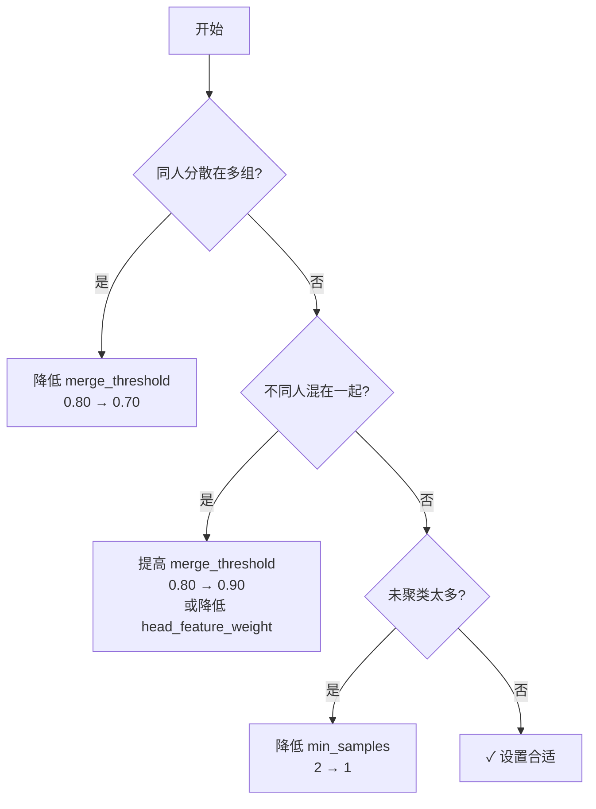

# Visage Configuration

> 完整配置说明、TOML 文件格式、优先级规则和调参指南

## 配置优先级 Priority

```
最高
│   CLI 参数 (--eps 0.6 --backend insightface)
│   显式配置文件 (--config path/to/config.toml)
│   输入目录 visage.toml (自动发现)
│   硬件自适应推荐 (hwdetect.py)
最低 代码默认值 (VisageConfig)
```

- **CLI 参数覆盖一切** — 即使配置文件中已有相同的项
- **配置文件按首次找到的为准** — `--config` > 输入目录下的 `visage.toml`
- **硬件推荐只填充未配置项** — 用户或文件已设置的项不受影响

## 配置文件格式 Config File Format

### 文件位置

1. 通过 `--config path/to/config.toml` 显式指定
2. 放在输入目录下自动发现: `INPUT_DIR/visage.toml`

### 完整示例 Full Example

```toml
# visage.toml — Visage 配置文件

[detection]
confidence = 0.6          # 最低检测置信度 (0~1)
min_face_size = 50        # 最小人脸尺寸 (像素)

[embedding]
backend = "insightface"   # 嵌入后端: dlib 或 insightface
model = "large"           # 模型: small (快) 或 large (准)
num_jitters = 2           # 采样次数 (dlib 专用)

[quality]
min_face_quality = 0.3    # 最低质量分 (0~1), 0=不过滤

[clustering]
method = "hdbscan"                       # 算法: dbscan 或 hdbscan
eps = 0.5                                # DBSCAN epsilon (DBSCAN 专用)
min_samples = 3                          # 最小样本数
min_cluster_size = 2                     # HDBSCAN 最小聚类大小
cluster_selection_epsilon = 0.0          # HDBSCAN 选择阈值
cluster_selection_method = "eom"         # eom 或 leaf
head_feature_weight = 0.0               # 头部特征权重 (0~1)
merge_threshold = 0.80                   # 合并阈值 (0~1)
small_merge_threshold = 0.75             # 小聚类宽松阈值
min_reliable_size = 10                   # 可靠聚类最小大小


[vector]
enabled = true                          # 启用 FAISS 向量索引
index_type = "auto"                     # auto, flat, 或 ivf
nlist = 100                             # IVF cell 数量

[ensemble]
enabled = false                         # 启用集成分类器
reject_threshold = 0.5                  # 拒绝阈值 (0~1)
knn_k = 5                               # KNN 邻居数
svm_c = 1.0                             # SVM 正则化参数

[output]
copy_mode = true                         # true=复制, false=移动
folder_prefix = "person_"                # 文件夹前缀
include_unclustered = false              # 包含未聚类
include_no_faces = false                 # 包含无脸照片
```

### 仅 CLI 可配置项

以下参数仅通过 CLI 参数设置，不支持在 TOML 中配置：
- `--output-dir` (输出目录)
- `--dry-run` (预览模式)
- `--json` (JSON 输出)
- `--quiet`, `--verbose` (日志级别)
- `--serve`, `--port`, `--no-open` (Web 服务)

## 各段详解 Section Details

### [detection] — 人脸检测

```toml
[detection]
confidence = 0.5          # 默认值
min_face_size = 40        # 默认值
```

| 键 | Python 字段 | 类型 | 范围 | 默认值 |
|----|-----------|------|------|--------|
| `confidence` | `detection_confidence` | float | 0.0 ~ 1.0 | 0.5 |
| `min_face_size` | `min_face_size` | int | ≥ 1 | 40 |

- **confidence**: Vision 框架的检测置信度阈值。降低可捕获更多模糊人脸，但可能增加误报
- **min_face_size**: 人脸边界框的最小边长 (像素)。提高可滤除小尺寸误检

### [embedding] — 特征嵌入

```toml
[embedding]
backend = "insightface"   # 或 "dlib"
model = "small"           # 或 "large"
num_jitters = 1           # dlib 专用
```

| 键 | Python 字段 | 类型 | 可选值 | 默认值 |
|----|-----------|------|--------|--------|
| `backend` | `embedding_backend` | string | `dlib`, `insightface` | `insightface` |
| `model` | `embedding_model` | string | `small`, `large` | `small` |
| `num_jitters` | `num_jitters` | int | ≥ 1 | 1 |

- **backend**: `dlib` 使用 face_recognition 库 (128维), `insightface` 使用 ArcFace (512维, 更高精度)
- **model**: 仅在 `dlib` 后端有效，`large` 更准但更慢
- **num_jitters**: 仅在 `dlib` 后端有效，多次采样取平均可提高鲁棒性

### [quality] — 质量过滤

```toml
[quality]
min_face_quality = 0.3
```

| 键 | Python 字段 | 类型 | 范围 | 默认值 |
|----|-----------|------|------|--------|
| `min_face_quality` | `min_face_quality` | float | 0.0 ~ 1.0 | 0.0 |

质量分数基于 Laplacian 模糊检测 + 人脸尺寸比例。高于阈值的脸才会生成嵌入。

### [clustering] — 聚类

```toml
[clustering]
method = "hdbscan"
eps = 0.5
min_samples = 2
min_cluster_size = 2
merge_threshold = 0.80
small_merge_threshold = 0.75
min_reliable_size = 10
head_feature_weight = 0.0
```

| 键 | Python 字段 | 类型 | 范围 | 默认值 |
|----|-----------|------|------|--------|
| `method` | `cluster_method` | string | `dbscan`, `hdbscan` | `hdbscan` |
| `eps` | `dbscan_eps` | float | > 0 | 0.5 |
| `min_samples` | `dbscan_min_samples` | int | ≥ 1 | 2 |
| `min_cluster_size` | `hdbscan_min_cluster_size` | int | ≥ 2 | 2 |
| `cluster_selection_epsilon` | `cluster_selection_epsilon` | float | ≥ 0 | 0.0 |
| `cluster_selection_method` | `cluster_selection_method` | string | `eom`, `leaf` | `eom` |
| `merge_threshold` | `merge_threshold` | float | 0.0 ~ 1.0 | 0.80 |
| `small_merge_threshold` | `small_merge_threshold` | float | 0.0 ~ 1.0 | 0.75 |
| `min_reliable_size` | `min_reliable_size` | int | ≥ 2 | 10 |
| `head_feature_weight` | `head_feature_weight` | float | 0.0 ~ 1.0 | 0.0 |

#### 参数调优指南

**HDBSCAN (推荐)** — 自动适应不同密度的聚类：



**DBSCAN** — 适合已知固定距离阈值：

| 症状 | 方案 |
|------|------|
| 同人分散 | 提高 `eps` (0.5 → 0.6) |
| 不同人混合 | 降低 `eps` (0.5 → 0.3) |
| 不确定参数 | 开启 `auto_eps` 自动估计 |

**后聚类合并 (Post-clustering Merge)**:

```
初始聚类 → 过度分割 → merge_threshold 合并相似聚类
                        ↑
              余弦相似度 > 0.80 → 合并
              余弦相似度 0.75~0.80 → 小聚类才合并
```

- `merge_threshold`: 两个聚类的质心余弦相似度超过此值则合并
- `small_merge_threshold`: 当其中一个聚类小于 `min_reliable_size` 时使用此宽松阈值
- 设为 0.0 可禁用合并

### 
[vector]
enabled = true                          # 启用 FAISS 向量索引
index_type = "auto"                     # auto, flat, 或 ivf
nlist = 100                             # IVF cell 数量

[ensemble]
enabled = false                         # 启用集成分类器
reject_threshold = 0.5                  # 拒绝阈值 (0~1)
knn_k = 5                               # KNN 邻居数
svm_c = 1.0                             # SVM 正则化参数

[output] — 输出

```toml

[vector]
enabled = true                          # 启用 FAISS 向量索引
index_type = "auto"                     # auto, flat, 或 ivf
nlist = 100                             # IVF cell 数量

[ensemble]
enabled = false                         # 启用集成分类器
reject_threshold = 0.5                  # 拒绝阈值 (0~1)
knn_k = 5                               # KNN 邻居数
svm_c = 1.0                             # SVM 正则化参数

[output]
copy_mode = true
folder_prefix = "person_"
include_unclustered = false
include_no_faces = false
```

| 键 | Python 字段 | 类型 | 默认值 |
|----|-----------|------|--------|
| `copy_mode` | `copy_mode` | bool | true |
| `folder_prefix` | `folder_prefix` | string | `person_` |
| `include_unclustered` | `include_unclustered` | bool | false |
| `include_no_faces` | `include_no_faces` | bool | false |

- **copy_mode**: `true` = 复制 (安全), `false` = 移动 (释放空间)
- **folder_prefix**: 输出文件夹名前缀，`person_` 产生 `person_00/`, `person_01/`, ...
- **include_unclustered**: 将未聚类照片放入 `_unclustered/` 文件夹
- **include_no_faces**: 将无脸照片放入 `_no_faces/` 文件夹

### [vector] — FAISS 向量索引 (Phase 2)

```toml
[vector]
enabled = true
index_type = "auto"
nlist = 100
```

| 键 | 类型 | 可选值 | 默认值 | 说明 |
|----|------|--------|--------|------|
| `enabled` | bool | - | true | 启用 FAISS 向量索引 |
| `index_type` | string | `auto`, `flat`, `ivf` | `auto` | 索引类型 (auto: 自动按规模选择) |
| `nlist` | int | ≥ 1 | 100 | IVF cell 数量 (仅 IVF 模式) |

- **auto**: 向量数 < 10,000 时使用 FlatIndex (精确搜索)，超过则自动切换 IVFFlat
- **flat**: 暴力搜索，适合小规模数据集 (< 10K)
- **ivf**: 倒排索引，适合大规模数据集 (> 10K)

### [ensemble] — 集成分类器 (Phase 2)

```toml
[ensemble]
enabled = false
reject_threshold = 0.5
knn_k = 5
svm_c = 1.0
```

| 键 | 类型 | 范围 | 默认值 | 说明 |
|----|------|------|--------|------|
| `enabled` | bool | - | false | 启用集成分类器 |
| `reject_threshold` | float | 0.0 ~ 1.0 | 0.5 | 低于此置信度拒绝分类 |
| `knn_k` | int | ≥ 1 | 5 | KNN 邻居数 |
| `svm_c` | float | > 0 | 1.0 | SVM 正则化参数 |

集成分类器组合三种子分类器的投票结果:
1. **Cosine KNN** — 余弦相似度 K 近邻
2. **Euclidean KNN** — 欧氏距离 K 近邻
3. **SVM (RBF)** — 支持向量机

权重根据各分类器在训练集上的准确率动态调整。

## 场景配置文件 Examples

### 场景一：快速浏览

```toml
# 低门槛配置 — 尽量多地检测人脸
[detection]
confidence = 0.3
min_face_size = 30

[clustering]
method = "hdbscan"
min_samples = 1
```

### 场景二：高精度

```toml
[embedding]
backend = "insightface"
model = "large"
num_jitters = 10

[detection]
confidence = 0.7
min_face_size = 60

[quality]
min_face_quality = 0.5
```

### 场景三：AI/动漫图片

```toml
# AI 生成图 — head_feature_weight = 0.0
# 因为 AI 图的头部姿势变化极大，不适合用头部特征
[clustering]
method = "hdbscan"
head_feature_weight = 0.0
merge_threshold = 0.75
min_samples = 2
```

### 场景四：大内存服务器

```toml
[detection]
max_workers = 16

[embedding]
backend = "insightface"
model = "large"
```
