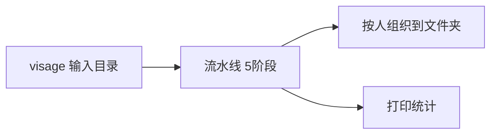
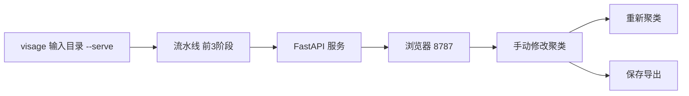

# Visage Development Guide

> 面向开发者和贡献者的完整指南

## 开发环境 Setup

### 前置条件 Prerequisites

- **macOS 13+** — Vision 框架依赖
- **Python 3.10+** — 推荐通过 `uv` 管理
- **cmake** — dlib 构建需要

```bash
# 安装 cmake
brew install cmake

# 安装 uv (如果尚未安装)
curl -LsSf https://astral.sh/uv/install.sh | sh
```

### 克隆与安装

```bash
git clone https://github.com/user/Visage.git
cd Visage

# 安装全部依赖 (推荐)
uv sync --extra dev --extra insightface --extra web

# 或者按需安装
uv sync --extra dev           # 仅开发工具 (pytest, ruff)
uv sync --extra web           # 仅 Web UI (fastapi, uvicorn)
uv sync --extra insightface   # 仅 InsightFace 后端
```

### 验证安装

```bash
visage --version
uv run pytest tests/ -q --tb=short
```

## 项目结构 Project Structure

```
Visage/
├── src/
│   └── visage/
│       ├── __init__.py        # 版本号
│       ├── align.py           # 人脸对齐 (仿射变换)
│       ├── backends.py        # 嵌入后端抽象 + 实现
│       ├── cache.py           # SQLite 嵌入缓存
│       ├── cli.py             # CLI 入口 (argparse)
│       ├── cluster.py         # 聚类算法 (DBSCAN/HDBSCAN + 合并)
│       ├── config.py          # 配置 (dataclass + TOML 加载)
│       ├── detector.py        # Vision 框架人脸检测
│       ├── embedder.py        # 嵌入生成 (批量)
│       ├── head_features.py   # 头部特征提取
│       ├── heic.py            # HEIC/HEIF 支持
│       ├── hwdetect.py        # 硬件检测 + 自动推荐
│       ├── models.py          # 核心数据模型 (dataclass)
│       ├── organizer.py       # 文件整理 (复制/移动)
│       ├── pipeline.py        # 5阶段流水线编排
│       ├── progress.py        # 进度显示 (rich)
│       ├── quality.py         # 人脸质量评估
│       ├── scanner.py         # 图片文件扫描
│       └── server/
│           ├── app.py         # FastAPI 应用 + SSE
│           ├── routes.py      # API 路由
│           └── workspace.py   # 内存工作区 (状态+修改+撤销)
├── frontend/
│   └── src/
│       ├── api.ts             # API 客户端 + TypeScript 类型
│       ├── App.tsx            # React 主应用
│       ├── components/        # UI 组件
│       │   ├── ClusterDetail.tsx
│       │   ├── ClusterRow.tsx
│       │   ├── Header.tsx
│       │   ├── NoisePanel.tsx
│       │   ├── PhotoCard.tsx
│       │   ├── PhotoGrid.tsx
│       │   ├── PhotoViewer.tsx
│       │   ├── PipelineLoader.tsx
│       │   ├── SaveDialog.tsx
│       │   ├── SettingsPanel.tsx
│       │   ├── Sidebar.tsx
│       │   └── Toast.tsx
│       ├── hooks/
│       ├── store/             # Zustand 状态管理
│       └── test/
├── tests/                     # Python 测试 (364 个)
└── docs/                      # 文档
```

## 流水线详解 Pipeline Deep Dive

### 数据流 Data Flow

```mermaid
flowchart LR
    subgraph Input
        IP[扫描图片路径]
    end

    subgraph Detect
        DF[逐图检测]
        FB[提取边界框]
        LM[获取5点特征点]
        HC[头部轮廓计算]
    end

    subgraph Embed
        FA[人脸对齐 112x112]
        Cache[(SQLite 缓存)]
        BE[嵌入后端<br/>dlib / InsightFace]
    end

    subgraph Cluster
        EX[提取全部嵌入]
        LD[L2 归一化]
        HC2[HDBSCAN 聚类]
        MC[后聚类合并]
    end

    IP --> DF --> FB --> LM --> HC
    HC --> FA
    FA --> Cache
    Cache -->|命中跳过| BE
    BE --> EX --> LD --> HC2 --> MC

    HC2 -.->|–serve| WS[Workspace 内存状态]
    MC -.-> WS

    WS --> UI[Web UI 审查]
    UI --> Save[导出整理结果]
```



### 各模块职责

| 模块 | 职责 | 关键函数 |
|------|------|----------|
| `scanner.py` | 递归扫描目录，过滤支持格式 | `scan_images()` |
| `detector.py` | macOS Vision 人脸检测 | `detect_faces_batch()` |
| `backends.py` | 嵌入后端协议 + 实现 | `get_backend()` |
| `embedder.py` | 批量生成嵌入 + 缓存查询 | `generate_embeddings_batch()` |
| `cluster.py` | 向量提取 + 聚类 + 置信度 + 合并 | `cluster_faces()`, `merge_clusters()` |
| `organizer.py` | 构建组织计划 + 执行复制/移动 | `build_organize_plan()`, `execute_organize_plan()` |
| `pipeline.py` | 5阶段流水线编排 | `run_pipeline()` |
| `config.py` | TOML 加载 + 硬件自适应 | `build_config()` |
| `hwdetect.py` | 内存检测 + 参数推荐 | `detect_hardware()`, `recommend_config()` |

## 测试 Testing

### Python 测试

```bash
# 运行全部测试
uv run pytest tests/

# 快速运行 (简短输出)
uv run pytest tests/ -q --tb=short

# 运行特定测试文件
uv run pytest tests/test_cluster.py -v

# 运行特定测试类
uv run pytest tests/test_config.py::TestVisageConfigDefaults -v

# 带覆盖率
uv run pytest tests/ --cov=visage
```

### 前端测试

```bash
cd frontend

# 运行全部测试
npx vitest run

# watch 模式
npx vitest

# 带 UI
npx vitest --ui
```

### 代码检查

```bash
# Python lint
uv run ruff check src/

# Python lint + 自动修复
uv run ruff check --fix src/

# 类型检查
uv run mypy src/visage/ --ignore-missing-imports

# 前端 lint
cd frontend && npm run lint
```

## 构建 Frontend Build

```bash
cd frontend

# 安装依赖 (首次)
npm install

# 开发模式 (热重载)
npm run dev

# 生产构建
npm run build

# 构建后复制到 server static
cp -r dist/* ../src/visage/server/static/
```

## 工作模式 Working Modes

### 批量模式 (默认)



### 审查模式 (--serve)



## 常见开发任务 Common Tasks

### 添加新的嵌入后端

1. 在 `backends.py` 中实现 `EmbeddingBackend` 协议
2. 在 `get_backend()` 中添加后端选择逻辑
3. 在 `config.py` 中注册新后端名称的验证
4. 在 `cli.py` 的 `--backend` 参数中添加新选项
5. 添加测试

### 添加新的聚类算法

1. 在 `cluster.py` 中实现新算法函数
2. 更新 `cluster_faces()` 中的方法选择逻辑
3. 在 `config.py` 中添加新参数和验证
4. 在 `cli.py` 中添加 CLI 参数
5. 在 `routes.py` 的 `/recluster` 端点中添加参数传递
6. 在 `api.ts` 中更新 `ReclusterSettings` 类型

### 添加新的 API 端点

1. 在 `routes.py` 中添加路由函数
2. 在 `workspace.py` 中添加相应的方法
3. 在 `api.ts` 中添加 API 调用函数
4. 创建前端 UI 组件调用该 API

## 撤销栈机制 Undo Stack

所有修改操作使用快照模式实现撤销：

```python
# 1. 操作前保存快照
self._history.append(_Operation(
    kind="merge",
    data={"from_id": from_id, "from_photos": [...], "face_snapshot": {...}}
))

# 2. 执行操作
self._cluster_mapping[to_id].extend(from_photos)
del self._cluster_mapping[from_id]

# 3. 撤销时恢复快照
op = self._history.pop()
self._cluster_mapping[from_id] = op.data["from_photos"]
self._restore_face_clusters(op.data["face_snapshot"])
```

关键设计点：
- 只保存受影响数据的快照，而非完整状态 (O(1) 空间)
- 人脸级别追踪 (face clusters) 也纳入快照
- 合并/移动/删除/重命名 各有独立的撤销逻辑

## 发布流程 Release Process

1. 更新 `__init__.py` 中的版本号
2. 更新 `CHANGELOG` (如存在)
3. 运行全部测试
4. 前端构建并复制到 static 目录
5. 提交并打 tag
6. `git push origin --tags`

### 补充：Frontend static 构建

```bash
# 构建前端
cd frontend && npm run build

# 复制到 server static
rm -rf ../src/visage/server/static/*
cp -r dist/* ../src/visage/server/static/
```
