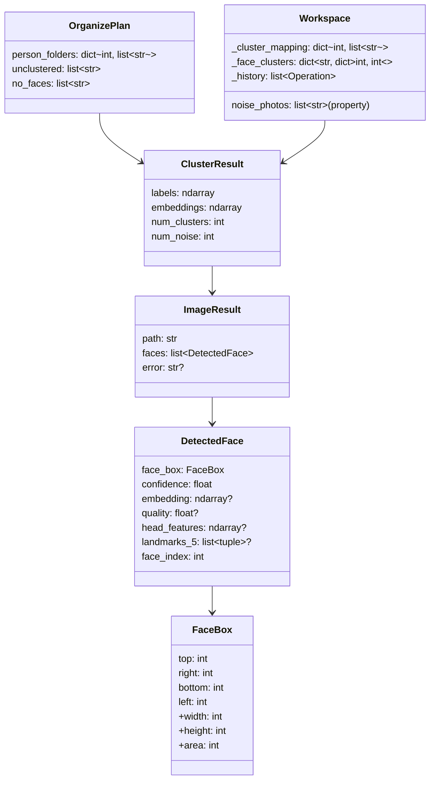

# Visage Reference

> CLI reference, API documentation, and data model specification

## CLI Reference

### 基础用法 Basic Usage

```bash
visage <INPUT_DIR> [OPTIONS]
```

### 输出 Output

| 选项 | 默认值 | 说明 |
|------|--------|------|
| `-o, --output-dir TEXT` | `<input>/visage_output` | 输出目录 |
| `--move` | 复制 (默认) | 移动文件而非复制 |
| `--dry-run` | 关闭 | 预览整理方案，不修改文件 |

### 检测 Detection

| 选项 | 默认值 | 说明 |
|------|--------|------|
| `--min-confidence FLOAT` | 0.5 | 最低检测置信度 (0~1) |
| `--max-workers INT` | 4 | 并行检测线程数 |

### 嵌入 Embedding

| 选项 | 默认值 | 说明 |
|------|--------|------|
| `--backend TEXT` | `dlib` | 嵌入后端: `dlib` 或 `insightface` |
| `--model TEXT` | `small` | 模型大小: `small` (快) 或 `large` (准) |
| `--num-jitters INT` | 1 | 采样次数 (dlib 专用) |

### 质量 Quality

| 选项 | 默认值 | 说明 |
|------|--------|------|
| `--min-quality FLOAT` | 0 | 最低质量分 (0~1, 0=不过滤) |

### 聚类 Clustering

| 选项 | 默认值 | 说明 |
|------|--------|------|
| `--cluster-method TEXT` | `hdbscan` | 算法: `dbscan` 或 `hdbscan` |
| `--eps FLOAT` | 0.5 | DBSCAN epsilon (只用于 DBSCAN) |
| `--min-samples INT` | 2 | 最小样本数 (也作为 HDBSCAN min_samples) |
| `--auto-eps` | 关闭 | 自动估计 eps (只用于 DBSCAN) |
| `--min-cluster-size INT` | 2 | HDBSCAN 最小聚类大小 |
| `--cluster-selection-epsilon FLOAT` | 0.0 | HDBSCAN 选择阈值 (>0 可能触发 sklearn bug) |
| `--cluster-selection-method TEXT` | `eom` | 选择方法: `eom` (稳定) 或 `leaf` (精细) |
| `--merge-threshold FLOAT` | 0.80 | 后聚类合并阈值 (余弦相似度 0~1) |
| `--small-merge-threshold FLOAT` | 0.75 | 小聚类宽松合并阈值 |
| `--min-reliable-size INT` | 10 | 低于此大小使用宽松阈值 |
| `--head-feature-weight FLOAT` | 0.0 | 头部特征权重 (AI 图建议 0.0) |

### 包含 Include

| 选项 | 默认值 | 说明 |
|------|--------|------|
| `--include-unclustered` | 关闭 | 包含未聚类照片 |
| `--include-no-faces` | 关闭 | 包含无脸照片 |

### 显示 Display

| 选项 | 默认值 | 说明 |
|------|--------|------|
| `--json` | 关闭 | JSON 格式输出 |
| `-q, --quiet` | 关闭 | 静默模式 |
| `-v, --verbose` | 关闭 | 详细日志 |
| `--config TEXT` | 无 | TOML 配置文件路径 |
| `--version` | - | 打印版本号 |

### Web 服务 Serve

| 选项 | 默认值 | 说明 |
|------|--------|------|
| `--serve` | 关闭 | 启动 Web 界面 |
| `--port INT` | 8787 | Web 服务端口 |
| `--no-open` | 关闭 | 不自动打开浏览器 |

---

## API Reference

所有 API 端点位于 `/api` 前缀下。

### GET /api/workspace

获取完整工作区状态。

**响应:**
```json
{
  "input_dir": "/path/to/photos",
  "config": {
    "copy_mode": true,
    "folder_prefix": "person_",
    "embedding_backend": "insightface"
  },
  "stats": {
    "total_images": 100,
    "images_with_faces": 80,
    "total_faces": 95,
    "num_clusters": 12,
    "num_noise_faces": 5
  },
  "clusters": [
    {
      "id": 0,
      "name": "person_00",
      "photos": [
        {
          "path": "/path/to/photo.jpg",
          "faces": [
            {"top": 10, "right": 100, "bottom": 120, "left": 5, "cluster_id": 0}
          ],
          "width": 1920,
          "height": 1080
        }
      ],
      "photo_count": 5,
      "thumbnail": "/path/to/thumb.jpg",
      "confidence": 0.95
    }
  ],
  "noise_photos": [...],
  "all_photos": [...],
  "next_cluster_id": 13,
  "can_undo": false
}
```

### GET /api/image

获取图片 (缩略图或原图)。

| 参数 | 类型 | 说明 |
|------|------|------|
| `path` | string | 图片绝对路径 |
| `size` | string | `thumb` (默认) 或 `full` |

### POST /api/clusters/merge

合并两个聚类。

**请求体:**
```json
{"from_id": 3, "to_id": 5}
```

**响应:** `{"ok": true, "workspace": {...}}`

### POST /api/clusters/{cluster_id}/remove

从聚类中移除一张照片 (变为未聚类)。

**请求体:**
```json
{"image_path": "/path/to/photo.jpg"}
```

### POST /api/clusters/{cluster_id}/remove-batch

批量移除照片。

**请求体:**
```json
{"image_paths": ["/path/to/1.jpg", "/path/to/2.jpg"]}
```

### POST /api/clusters/move

移动照片到其他聚类。

**请求体:**
```json
{"image_path": "/path/to/photo.jpg", "from_id": 3, "to_id": 5}
```

### POST /api/clusters/assign

从未聚类分配到聚类。

**请求体:**
```json
{"image_path": "/path/to/photo.jpg", "to_id": 5}
```

### POST /api/clusters/assign-batch

批量分配未聚类照片。

**请求体:**
```json
{"image_paths": ["/path/to/1.jpg", "..."], "to_id": 5}
```

### PUT /api/clusters/{cluster_id}

重命名聚类。若名已存在则自动合并。

**请求体:**
```json
{"name": "Alice"}
```

### POST /api/clusters/undo

撤销上一次操作。

**响应:** `{"ok": true, "undo": {"kind": "merge", ...}, "workspace": {...}}`

### POST /api/recluster

使用新参数重新聚类 (利用已有嵌入向量)。

**请求体:**
```json
{
  "cluster_method": "hdbscan",
  "min_samples": 2,
  "min_cluster_size": 2,
  "cluster_selection_epsilon": 0.0,
  "cluster_selection_method": "eom",
  "merge_threshold": 0.80,
  "small_merge_threshold": 0.75,
  "min_reliable_size": 10,
  "head_feature_weight": 0.0
}
```

所有字段可选，省略则使用工作区当前配置。

### POST /api/save

导出整理结果到磁盘。

**请求体:**
```json
{
  "output_dir": "/path/to/output",
  "copy_mode": true,
  "folder_prefix": "person_",
  "include_unclustered": false,
  "include_no_faces": false,
  "cluster_ids": [0, 1, 2]
}
```

所有字段可选，省略则使用配置默认值。

### GET /api/config

获取当前配置。

### GET /api/pipeline-status

SSE 事件流，流式推送流水线进度。

```text
data: {"phase": 2, "message": "2/5 Detection — 45/100"}
data: {"phase": 2, "message": "2/5 Detection — 80/100", "done": true}
```

---

## 数据模型 Data Model

### 核心类型 Core Types



### 前端 TypeScript 类型

```typescript
interface FaceBox {
  top: number;
  right: number;
  bottom: number;
  left: number;
  cluster_id: number;  // -1 = 未聚类
}

interface PhotoInfo {
  path: string;
  faces: FaceBox[];
  width: number;
  height: number;
}

interface ClusterInfo {
  id: number;
  name: string;
  photos: PhotoInfo[];
  photo_count: number;
  thumbnail: string | null;
  confidence: number;
}

interface WorkspaceState {
  input_dir: string;
  config: { copy_mode, folder_prefix, embedding_backend };
  stats: { total_images, images_with_faces, total_faces, num_clusters, num_noise_faces };
  clusters: ClusterInfo[];
  noise_photos: PhotoInfo[];
  all_photos: PhotoInfo[];
  next_cluster_id: number;
  can_undo: boolean;
}
```

---

## 支持的文件格式 Supported Formats

| 格式 | 扩展名 | 支持 |
|------|--------|------|
| JPEG | `.jpg`, `.jpeg` | ✅ 完整支持 |
| PNG | `.png` | ✅ 完整支持 |
| HEIC | `.heic` | ✅ pillow-heif + macOS sips 回退 |
| HEIF | `.heif` | ✅ pillow-heif + macOS sips 回退 |
| TIFF | `.tif`, `.tiff` | ✅ 通过 Pillow |

---

## 硬件检测 Hardware Detection

`hwdetect.py` 在启动时自动检测硬件并推荐配置：

| 内存 | 核心数 | 推荐后端 | 推荐 workers | 说明 |
|------|--------|----------|-------------|------|
| < 4 GB | < 4 | dlib | 2 | 低配 — 保守配置 |
| 4-8 GB | 4-8 | dlib | 4 | 普通 |
| 8-16 GB | 8+ | insightface | 8 | 推荐 |
| 16+ GB | 12+ | insightface | 16 | 高配 — 启用 float32 优化 |
